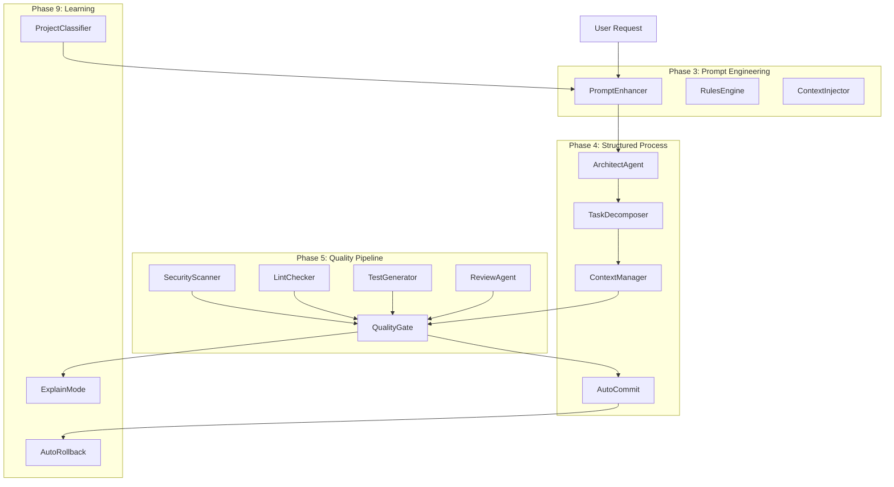
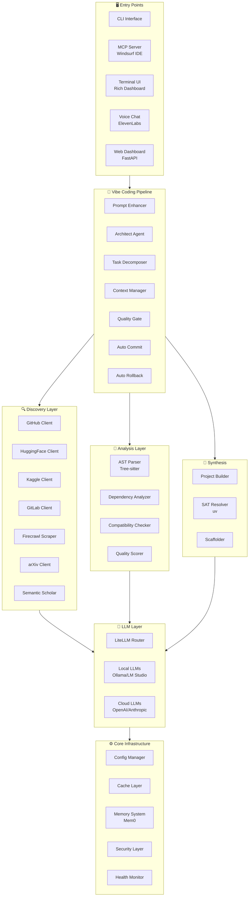
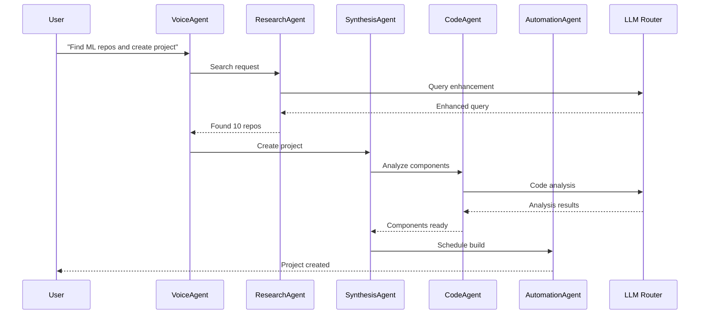
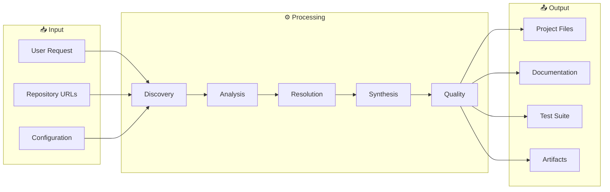

<div align="center">

# 🧬 AI Project Synthesizer

### The Ultimate AI-Powered Vibe Coder & Multi-Repository Synthesis Platform

[](https://opensource.org/licenses/MIT)
[](https://www.python.org/downloads/)
[](https://modelcontextprotocol.io/)
[](https://windsurf.ai/)
[](https://github.com/psf/black)
[](https://mypy.readthedocs.io/)
[](tests/)
[](CHANGELOG.md)

**Transform hours of research into minutes of intelligent synthesis**

[Quick Start](#-quick-start) •
[Features](#-complete-feature-matrix) •
[Architecture](#-architecture) •
[Vibe Coding](#-vibe-coding-pipeline) •
[Documentation](#-documentation)

</div>

---

## 📊 Project Scale & Metrics

| Metric | Count | Description |
|--------|-------|-------------|
| **Source Files** | 141+ | Core Python modules across 20+ packages |
| **Classes** | 461+ | Object-oriented components |
| **Functions** | 1,888+ | Callable implementations |
| **Module Groups** | 27 | Major functional areas |
| **MCP Tools** | 12+ | IDE integration tools |
| **AI Agents** | 5 | Specialized agent types |
| **Agent Frameworks** | 4 | AutoGen, CrewAI, LangGraph, Swarm |
| **LLM Providers** | 13+ | Local + Cloud providers supported |
| **n8n Workflows** | 10 | Automation templates |
| **Platforms** | 7+ | GitHub, HuggingFace, Kaggle, arXiv, GitLab, Firecrawl, Semantic Scholar |
| **Voice Profiles** | 20+ | ElevenLabs voices with cloning support |
| **Test Coverage** | 85%+ | 245+ tests passing |
| **Recipes** | 4+ | Pre-built project templates |

> 📁 For a full auto-generated inventory, see: [`scripts/feature_inventory.md`](scripts/feature_inventory.md)

---

## 🎯 What Is This?

The **AI Project Synthesizer** is a production-ready **Vibe Coder** system that combines:

- **MCP Server** - Model Context Protocol integration for Windsurf IDE
- **Multi-Agent Architecture** - 5 specialized agents with 4 framework integrations
- **Repository Synthesis** - Discover, analyze, and merge code from multiple sources
- **Quality Gates** - Automated lint, security, and test generation
- **Voice Interface** - Natural language control with ElevenLabs TTS
- **Persistent Memory** - Mem0 integration for learning across sessions
- **Vibe Coding Pipeline** - End-to-end automation from prompt to production code

### Core Capabilities

| Capability | Description |
|------------|-------------|
| 🔍 **Discover** | Search GitHub, HuggingFace, Kaggle, arXiv, GitLab, and web scraping |
| 🔬 **Analyze** | AST parsing (100+ languages), dependency mapping, quality scoring |
| 🔧 **Synthesize** | SAT-based conflict resolution, selective component extraction |
| 📝 **Generate** | Auto-create documentation, diagrams, tests, and scaffolding |
| 🛡️ **Quality Gate** | Lint checks, security scanning, auto-repair capabilities |
| 🎤 **Voice Control** | Natural language commands, 20+ voice profiles, voice cloning |
| 🧠 **Memory** | Persistent learning, conversation history, project patterns |

---

## 🏆 Milestones & Roadmap

### ✅ Completed Milestones

| Version | Milestone | Key Features | Date |
|---------|-----------|--------------|------|
| **v1.0** | Core Engine | Discovery, Analysis, Basic Synthesis | Dec 2024 |
| **v1.1** | Multi-Platform | GitHub, HuggingFace, Kaggle integration | Dec 2024 |
| **v1.2** | AST Parsing | Tree-sitter for 100+ languages, dependency analysis | Dec 2024 |
| **v1.3** | Synthesis | Project merging, SAT conflict resolution | Dec 2024 |
| **v1.4** | MCP Server | 8 MCP tools, Windsurf IDE integration | Dec 2024 |
| **v1.5** | Voice System | ElevenLabs TTS, 20+ voices, streaming audio | Dec 2024 |
| **v1.6** | Terminal UI | Rich dashboard, 7 views, real-time updates | Dec 2024 |
| **v1.7** | Automation | 10 n8n workflows, webhooks, scheduled tasks | Dec 2024 |
| **v1.8** | Multi-Agent | 5 agents, AutoGen/CrewAI/LangGraph/Swarm | Dec 2024 |
| **v1.9** | Memory System | Mem0 integration, conversation history, learning | Dec 2024 |
| **v2.0** | Vibe Coding | Complete pipeline: prompt → quality gate → commit | Dec 2024 |

### 🚀 Current Focus (v2.x)

| Feature | Status | Target | Description |
|---------|--------|--------|-------------|
| Quality Gate Auto-Repair | 🟡 Active | v2.1 | AI-powered code fixing |
| Enhanced Firecrawl | 🟡 Active | v2.1 | Advanced web scraping with caching |
| Voice Cloning Pipeline | 🟡 Active | v2.1 | Piper/Coqui model training from samples |
| Cloud Deployment | 📋 Planned | v2.2 | Docker Compose, Kubernetes templates |
| Real-time Collaboration | 📋 Planned | v2.3 | Multi-user workspaces |
| Plugin Marketplace | 📋 Planned | v2.4 | Share synthesis templates |

### 🔮 Future Vision (v3.0+)

- **Multi-IDE Support** - VS Code, Cursor, Zed extensions
- **Team Workspaces** - Collaborative project synthesis
- **Private Repository Indexing** - Enterprise codebase analysis
- **Custom Agent Training** - Fine-tune on your workflow
- **Synthesis Marketplace** - Share and discover templates

---

## ✨ Complete Feature Matrix

### 🔍 Discovery & Search

| Feature | Description | Status |
|---------|-------------|--------|
| **GitHub Client** | Full API: stars, forks, topics, language filtering | ✅ |
| **HuggingFace Client** | Models, datasets, spaces discovery | ✅ |
| **Kaggle Client** | Datasets, notebooks, competitions | ✅ |
| **GitLab Client** | API integration, cloning, analysis | ✅ |
| **arXiv Client** | Paper search with code links | ✅ |
| **Semantic Scholar** | Academic paper search | ✅ |
| **Firecrawl Enhanced** | Web scraping with caching, rate limiting | ✅ |
| **Unified Search** | Single API across all platforms | ✅ |
| **Trend Analysis** | Detect trending repositories | ✅ |
| **Bookmark System** | Save and organize favorites | ✅ |
| **Search History** | Track and replay searches | ✅ |
| **Smart Filtering** | Stars, language, license, activity | ✅ |

### 🔬 Analysis & Parsing

| Feature | Description | Status |
|---------|-------------|--------|
| **AST Parser** | Tree-sitter for 100+ languages | ✅ |
| **Code Extractor** | Component identification | ✅ |
| **Dependency Analyzer** | Full graph generation | ✅ |
| **Compatibility Checker** | Version conflict detection | ✅ |
| **Quality Scorer** | Tests, docs, maintenance metrics | ✅ |
| **Complexity Analysis** | Cyclomatic complexity tracking | ✅ |
| **Security Scanning** | Vulnerability detection | ✅ |
| **License Detection** | Identify repository licenses | ✅ |

#### Supported Languages (AST Parsing)

| Language | Parser | Dependency Files |
|----------|--------|------------------|
| Python | Tree-sitter + AST | requirements.txt, pyproject.toml, setup.py |
| JavaScript | Tree-sitter | package.json |
| TypeScript | Tree-sitter | package.json, tsconfig.json |
| Rust | Tree-sitter | Cargo.toml |
| Go | Tree-sitter | go.mod |
| Java | Tree-sitter | pom.xml, build.gradle |
| C/C++ | Tree-sitter | CMakeLists.txt, Makefile |

### 🔧 Synthesis & Resolution

| Feature | Description | Status |
|---------|-------------|--------|
| **Smart Merging** | Combine multiple repositories | ✅ |
| **SAT Conflict Resolution** | Dependency solving via `uv` | ✅ |
| **Selective Extraction** | Pull only components you need | ✅ |
| **Template Support** | Copier scaffolding integration | ✅ |
| **Project Assembly** | Unified output structure | ✅ |
| **Config Generation** | Auto-generate project configs | ✅ |
| **Auto-Commit** | Intelligent version control | ✅ |
| **Transitive Dependencies** | Resolve full dependency tree | ✅ |

#### Project Templates

| Template | Description | Tech Stack |
|----------|-------------|------------|
| `python-default` | Standard Python project | Python, pytest, ruff |
| `python-ml` | Machine learning project | Python, PyTorch, HuggingFace |
| `python-web` | Web application | FastAPI/Flask, SQLAlchemy |
| `minimal` | Bare bones structure | Python only |

### 📝 Documentation & Generation

| Feature | Description | Status |
|---------|-------------|--------|
| **Auto README** | AI-powered generation | ✅ |
| **API Docs** | Auto-extracted from code | ✅ |
| **Mermaid Diagrams** | Architecture visualization | ✅ |
| **Dependency Graphs** | Visual dependency mapping | ✅ |
| **Changelog Generation** | Auto-track changes | ✅ |
| **Code Comments** | AI-enhanced documentation | ✅ |
| **Architecture Docs** | System design documentation | ✅ |


---

## 🤖 AI Agents System

### Core Agents (5 Specialized)

| Agent | Purpose | Key Features |
|-------|---------|--------------|
| **ResearchAgent** | Repository discovery | Trend analysis, multi-platform search, smart filtering |
| **SynthesisAgent** | Code merging | Dependency resolution, conflict handling, selective extraction |
| **VoiceAgent** | Voice interaction | Speech recognition, TTS, natural language commands |
| **AutomationAgent** | Task automation | Scheduling, recovery, monitoring, n8n integration |
| **CodeAgent** | Code generation | Analysis, refactoring, test generation, documentation |

### Agent Framework Integrations

| Framework | Description | Use Case |
|-----------|-------------|----------|
| **AutoGen** | Multi-agent conversations | Code review debates, pair programming |
| **CrewAI** | Role-based agent teams | Specialized task delegation |
| **LangGraph** | Complex workflow orchestration | Multi-step pipelines |
| **Swarm** | Lightweight agent coordination | Simple agent handoffs |

<details>
<summary><b>🔍 ResearchAgent - Repository Discovery</b></summary>

**Purpose:** Discover and analyze repositories across platforms

**Tools:**
- `search_repos` - Multi-platform search
- `analyze_trending` - Find trending repositories
- `filter_results` - Apply smart filters
- `bookmark_repo` - Save for later

**Example:**
```python
from src.agents import ResearchAgent

agent = ResearchAgent()
result = await agent.run({
    "query": "machine learning transformers",
    "platforms": ["github", "huggingface"],
    "min_stars": 5000,
    "max_results": 10
})
```

**Capabilities:**
- Semantic search across 7+ platforms
- Trend detection and analysis
- Quality pre-filtering
- Caching and rate limiting

</details>

<details>
<summary><b>🔧 SynthesisAgent - Code Merging</b></summary>

**Purpose:** Merge multiple repositories into unified projects

**Tools:**
- `analyze_repos` - Analyze source repositories
- `resolve_conflicts` - Resolve dependency conflicts
- `merge_code` - Intelligent code merging
- `generate_config` - Generate project configuration

**Example:**
```python
from src.agents import SynthesisAgent

agent = SynthesisAgent()
result = await agent.run({
    "repositories": ["repo1_url", "repo2_url"],
    "output_name": "my_project",
    "strategy": "selective",
    "components": ["auth", "api", "models"]
})
```

**Strategies:**
| Strategy | Description |
|----------|-------------|
| `full` | Merge entire repositories |
| `selective` | Choose specific components |
| `minimal` | Core functionality only |
| `template` | Use Copier scaffolding |

</details>

<details>
<summary><b>🎤 VoiceAgent - Voice Interaction</b></summary>

**Purpose:** Natural language voice-controlled assistant

**Voice Commands:**
| Command | Action |
|---------|--------|
| "Search for [query]" | Search repositories |
| "Create project [name]" | Start synthesis |
| "Show status" | Current operation status |
| "Analyze [repo]" | Analyze repository |
| "Open settings" | Open settings panel |
| "Stop listening" | Pause voice recognition |

**Modes:**
| Mode | Description | Activation |
|------|-------------|------------|
| `push_to_talk` | Hold to speak | Ctrl+Space |
| `continuous` | Always listening | Toggle on |
| `disabled` | Voice off | Toggle off |

**Configuration:**
```python
voice_config = {
    "provider": "elevenlabs",
    "voice_id": "rachel",
    "speed": 1.0,
    "stability": 0.5,
    "streaming": True
}
```

</details>

<details>
<summary><b>⚡ AutomationAgent - Task Scheduling</b></summary>

**Purpose:** Automate recurring tasks and workflows

**Tools:**
- `schedule_task` - Schedule a task
- `run_workflow` - Execute n8n workflow
- `monitor_health` - Health monitoring
- `recover_component` - Auto-recovery

**Example:**
```python
from src.agents import AutomationAgent

agent = AutomationAgent()
await agent.schedule_task({
    "name": "daily_research",
    "cron": "0 9 * * *",
    "action": "search_trending",
    "params": {"platforms": ["github"], "limit": 20}
})
```

**Built-in Schedules:**
| Schedule | Frequency | Action |
|----------|-----------|--------|
| Trending Repos | Daily 9 AM | search_trending |
| Health Check | Hourly | monitor_health |
| Dependency Audit | Monthly | security_scan |
| Bookmark Sync | Hourly | sync_bookmarks |

</details>

<details>
<summary><b>💻 CodeAgent - Code Analysis</b></summary>

**Purpose:** Analyze, review, and refactor code

**Tools:**
- `analyze_code` - Deep code analysis
- `find_issues` - Find code issues
- `suggest_refactoring` - Refactoring suggestions
- `generate_tests` - Generate test cases
- `review_pr` - Pull request review

**Metrics Tracked:**
| Metric | Description |
|--------|-------------|
| Cyclomatic complexity | Code complexity score |
| Lines of code | Size metrics |
| Test coverage | Testing percentage |
| Documentation coverage | Doc completeness |
| Security vulnerabilities | CVE detection |
| Dependency freshness | Outdated packages |

</details>

<details>
<summary><b>🔄 AutoGen Integration - Multi-Agent Conversations</b></summary>

**Purpose:** Sophisticated conversation patterns for code review

**Features:**
- Two-agent conversation for code review
- Integration with VoiceManager for spoken feedback
- Quality validation and security checking
- Extensible framework for additional agents

**Example:**
```python
from src.agents.autogen_integration import AutoGenIntegration

autogen = AutoGenIntegration(enable_voice_output=True)
result = await autogen.review_code(
    code="def hello(): print('world')",
    context={"language": "python"}
)
```

**Result Structure:**
```python
@dataclass
class CodeReviewResult:
    code_quality_score: float
    security_issues: list[str]
    suggestions: list[str]
    approved: bool
    agent_consensus: str
```

</details>

---

## 🎯 Vibe Coding Pipeline

The Vibe Coding Pipeline transforms natural language requests into production-ready code with full automation.

### Pipeline Architecture



### Pipeline Components

| Component | Phase | Purpose |
|-----------|-------|---------|
| **PromptEnhancer** | 3 | Enhance prompts with context, constraints, best practices |
| **RulesEngine** | 3 | YAML-based coding rules with priority resolution |
| **ContextInjector** | 3 | Project type detection, git status, environment info |
| **ArchitectAgent** | 4 | Pattern detection, component identification, data flow |
| **TaskDecomposer** | 4 | LLM-powered task breakdown with dependencies |
| **ContextManager** | 4 | Phase lifecycle, checkpoints, Mem0 persistence |
| **AutoCommit** | 4 | Structured commits, branch management |
| **SecurityScanner** | 5 | Semgrep, Bandit, CVE scanning |
| **LintChecker** | 5 | Ruff, ESLint, MyPy, Prettier integration |
| **TestGenerator** | 5 | Pytest/Jest generation, coverage analysis |
| **ReviewAgent** | 5 | AutoGen-based multi-agent code review |
| **QualityGate** | 5 | Pass/fail decisions, auto-fix loops |
| **AutoRollback** | 9 | Automatic recovery, checkpoint restoration |
| **ExplainMode** | 9 | Code decision explanations |
| **ProjectClassifier** | 9 | Type detection, stack identification |

### Complete Pipeline Example

```python
from src.vibe import (
    PromptEnhancer, ArchitectAgent, TaskDecomposer,
    ContextManager, AutoCommit, AutoRollback
)
from src.quality import QualityGate

async def vibe_coding_pipeline(user_request: str):
    # 1. Enhance prompt with context
    enhancer = PromptEnhancer()
    enhanced_prompt = await enhancer.enhance(user_request, context)
    
    # 2. Create architectural plan
    architect = ArchitectAgent()
    arch_plan = await architect.create_architecture(enhanced_prompt, context)
    
    # 3. Decompose into phases
    decomposer = TaskDecomposer()
    task_plan = await decomposer.decompose(enhanced_prompt, arch_plan)
    
    # 4. Initialize context
    context_manager = ContextManager()
    task_context = await context_manager.create_context(task_plan)
    
    # 5. Process each phase with quality gates
    for phase in task_plan.phases:
        rollback = AutoRollback()
        rollback_point = await rollback.create_rollback_point(
            task_context.task_id, phase.id
        )
        
        try:
            await context_manager.start_phase(task_context.task_id, phase.id)
            
            # Generate code
            generated_code = await generate_code(phase.prompt)
            
            # Quality check
            quality_gate = QualityGate()
            quality_result = await quality_gate.evaluate(generated_code, context)
            
            if not quality_result.passed:
                raise Exception("Quality gate failed")
            
            await context_manager.complete_phase(task_context.task_id, phase.id)
            
            # Auto commit
            committer = AutoCommit()
            await committer.commit_phase(
                task_context.task_id, phase.id, phase.name
            )
            
        except Exception as e:
            await rollback.rollback_on_failure(
                task_context.task_id, phase.id, str(e), rollback_point
            )
            raise
    
    return task_context
```

### Quality Gate Configuration

```yaml
# config/quality_gate.yaml
quality_gate:
  security:
    enabled: true
    fail_on_high: true
    fail_on_medium: false
    max_issues: 0
  
  lint:
    enabled: true
    tools: ["ruff", "mypy"]
    auto_fix: true
    max_warnings: 5
  
  tests:
    enabled: true
    min_coverage: 80
    require_unit_tests: true
  
  review:
    enabled: true
    min_reviewers: 2
    auto_approve_simple: true
```

---

## 🎤 Voice System

### Voice Features

| Feature | Description | Status |
|---------|-------------|--------|
| **ElevenLabs TTS** | High-quality speech synthesis | ✅ |
| **20+ Voice Profiles** | Rachel, Josh, Adam, Bella, Domi, Sam, and more | ✅ |
| **Streaming Audio** | Real-time low-latency playback | ✅ |
| **Push-to-Talk** | Hotkey activation (Ctrl+Space) | ✅ |
| **Continuous Mode** | Always listening | ✅ |
| **Voice Commands** | Natural language control | ✅ |
| **Voice Cloning** | Piper/Coqui model training | 🟡 |
| **ASR Integration** | GLM speech recognition | ✅ |

### Voice Profiles

| Voice | Type | Best For |
|-------|------|----------|
| Rachel | Female, American | General assistant |
| Josh | Male, American | Technical explanations |
| Adam | Male, British | Professional tone |
| Bella | Female, British | Friendly interactions |
| Domi | Female, American | Energetic responses |
| Sam | Male, American | Casual conversations |
| Elli | Female, American | Clear instructions |
| Arnold | Male, American | Authoritative tone |
| Antoni | Male, American | Warm personality |

### Voice Cloning Pipeline

The voice cloning pipeline provides fail-safe TTS capabilities when cloud services are unavailable:

```python
from tools.voice_cloning_pipeline import VoiceCloningPipeline

pipeline = VoiceCloningPipeline(
    source_dir=Path("voices"),
    output_dir=Path("models/cloned"),
    backup_methods=["piper", "coqui", "basic"]
)

# Clone a voice from extracted samples
await pipeline.clone_voice(
    voice_name="rachel",
    samples_path="voices/english/american/rachel/",
    output_format="piper"
)
```

**Backup Methods:**
| Method | Description | Quality |
|--------|-------------|---------|
| Piper | Fast local TTS | High |
| Coqui | Neural TTS | Very High |
| Basic | Simple concatenation | Medium |

---

## 🖥️ Terminal UI (TUI)

### Available Views

| View | Description | Features |
|------|-------------|----------|
| **Dashboard** | System overview | Health status, metrics, quick actions |
| **Search** | Repository browser | Multi-platform search, filters, bookmarks |
| **Assembly** | Project synthesis wizard | Step-by-step project creation |
| **Agents** | Agent control panel | Start/stop, status, configuration |
| **Settings** | Configuration manager | 7 tabs of settings |
| **Metrics** | Performance monitoring | Real-time charts, logs |
| **Workflows** | n8n workflow manager | List, run, monitor workflows |

### Starting the TUI

```bash
# Start Terminal UI
python -m src.cli tui

# Or with specific view
python -m src.cli tui --view dashboard
python -m src.cli tui --view search
python -m src.cli tui --view agents
```

---

## 🍳 Recipe System

Recipes are pre-configured project templates that combine multiple repositories into ready-to-use projects.

### Available Recipes

| Recipe | Description | Sources |
|--------|-------------|---------|
| `mcp-server-starter` | Basic MCP server template | FastMCP, example tools |
| `rag-chatbot` | RAG chatbot with local LLM | LangChain, ChromaDB, Ollama |
| `web-scraper` | Async web scraper | Playwright, aiohttp |
| `ai-camera-stack` | AI camera with detection | Frigate, YOLO, MQTT |

### Recipe Usage

```bash
# List available recipes
python -m src.cli recipe list

# Show recipe details
python -m src.cli recipe show rag-chatbot

# Run a recipe
python -m src.cli recipe run rag-chatbot --output ./my-chatbot

# Validate a recipe file
python -m src.cli recipe validate my-recipe.yaml
```

### Recipe Schema

```yaml
name: recipe-name
version: 1.0.0
description: What this recipe creates

sources:
  - repo: https://github.com/owner/repo
    branch: main
    extract:
      - src/core/
      - src/utils/
    rename:
      src/core/: core/
      
  - repo: https://github.com/owner/repo2
    components:
      - name: auth
        path: src/auth/

synthesis:
  strategy: selective
  output_name: my-project
  template: python-default
  dependencies:
    merge: true
    python_version: "3.11"
  conflicts:
    strategy: prefer_first

post_synthesis:
  - generate_readme
  - generate_api_docs
  - run_tests
  - create_github_repo

variables:
  project_name:
    description: Name for the project
    default: my-project
```


---

## 🧠 LLM Integration

### Multi-Provider Support (13+ Providers)

#### Local Providers (Privacy-First)

| Provider | Description | Default Port | Models |
|----------|-------------|--------------|--------|
| **Ollama** | Recommended local LLM | 11434 | Qwen2.5-Coder, DeepSeek, Llama |
| **LM Studio** | GUI-based local LLM | 1234 | Any GGUF model |
| **LocalAI** | Self-hosted OpenAI alternative | 8080 | Various models |
| **vLLM** | High-performance inference | 8000 | HuggingFace models |
| **Text Generation WebUI** | Feature-rich UI | 5000 | Various models |
| **KoboldAI** | Story/chat focused | 5001 | Various models |
| **llama.cpp Server** | Pure C++ inference | 8080 | GGUF models |

#### Cloud Providers (Fallback)

| Provider | Models | Use Case |
|----------|--------|----------|
| **OpenAI** | GPT-4, GPT-4-Turbo | Complex reasoning |
| **Anthropic** | Claude-3.5-Sonnet | Long context, safety |
| **Groq** | Llama-3.1-70b | Fast inference |
| **Together AI** | Various open models | Cost-effective |
| **OpenRouter** | Multi-model gateway | Model variety |
| **Mistral AI** | Mistral-Large | European provider |
| **DeepSeek** | DeepSeek-Coder | Code specialized |
| **Cohere** | Command-R-Plus | Enterprise features |
| **Fireworks AI** | Various models | Speed optimized |

### LLM Configuration

```bash
# Primary provider (default: ollama)
LLM_PREFERRED_PROVIDER=ollama

# Model size preference
# Options: tiny (<2B), small (2-4B), medium (4-7B), large (8-14B)
LLM_MODEL_SIZE_PREFERENCE=medium

# Enable fallback between providers
LLM_FALLBACK_ENABLED=true

# Cloud routing threshold (0.0-1.0)
# Higher = more local, lower = more cloud
CLOUD_ROUTING_THRESHOLD=0.7
```

### Model Size Matrix (Ollama)

| Size | Model | Parameters | RAM Needed | Use Case |
|------|-------|------------|------------|----------|
| Tiny | qwen2.5-coder:1.5b | 1.5B | 4GB | Quick tasks |
| Small | qwen2.5-coder:3b | 3B | 6GB | Simple tasks |
| Medium | qwen2.5-coder:7b | 7B | 10GB | Balanced |
| Large | qwen2.5-coder:14b | 14B | 20GB | Complex tasks |

### LiteLLM Router

The system uses LiteLLM for unified access across all providers:

```python
from src.llm import LiteLLMRouter

router = LiteLLMRouter()

# Automatic routing based on task complexity
response = await router.complete(
    prompt="Explain recursion",
    task_type="explanation",  # Routes to appropriate model
    fallback=True  # Enable fallback on failure
)
```

---

## ⚙️ Configuration Reference

### Settings Manager (7 Tabs)

| Tab | Settings Count | Description |
|-----|----------------|-------------|
| **General** | 7 | Theme, language, logging, telemetry |
| **Voice** | 10 | Provider, voice, speed, hotkeys |
| **Automation** | 6 | Auto-continue, n8n, webhooks |
| **Hotkeys** | 8 | All keyboard shortcuts |
| **AI/ML** | 9 | LLM providers, models, parameters |
| **Workflows** | 5 | n8n configuration |
| **Advanced** | 6 | Cache, timeouts, debug |

### General Settings

| Setting | Type | Default | Description |
|---------|------|---------|-------------|
| `theme` | string | `"dark"` | UI theme (dark/light) |
| `language` | string | `"en"` | Interface language |
| `auto_save` | bool | `true` | Auto-save settings |
| `notifications` | bool | `true` | Show notifications |
| `telemetry` | bool | `false` | Anonymous usage data |
| `log_level` | string | `"INFO"` | DEBUG/INFO/WARNING/ERROR |
| `log_rotation` | string | `"10MB"` | Log file rotation size |

### Voice Settings

| Setting | Type | Default | Description |
|---------|------|---------|-------------|
| `mode` | enum | `"push_to_talk"` | push_to_talk/continuous/disabled |
| `provider` | string | `"elevenlabs"` | TTS provider |
| `voice_id` | string | `"rachel"` | Voice selection |
| `speed` | float | `1.0` | Speech speed (0.5-2.0) |
| `stability` | float | `0.5` | Voice stability (0.0-1.0) |
| `similarity_boost` | float | `0.75` | Voice similarity |
| `hotkey` | string | `"ctrl+shift+v"` | Toggle hotkey |
| `push_to_talk_key` | string | `"ctrl+space"` | PTT hotkey |
| `auto_play` | bool | `true` | Auto-play responses |
| `streaming` | bool | `true` | Stream audio output |

### AI/ML Settings

| Setting | Type | Default | Description |
|---------|------|---------|-------------|
| `primary_provider` | string | `"ollama"` | Primary LLM |
| `fallback_provider` | string | `"openai"` | Fallback LLM |
| `model` | string | `"qwen2.5-coder:14b"` | Model name |
| `temperature` | float | `0.7` | Generation temperature |
| `max_tokens` | int | `4096` | Max output tokens |
| `context_window` | int | `32768` | Context size |
| `top_p` | float | `0.9` | Top-p sampling |
| `timeout` | int | `120` | Request timeout (seconds) |
| `retry_attempts` | int | `3` | Number of retries |

### Hotkey Reference

| Action | Default | Description |
|--------|---------|-------------|
| `voice_toggle` | Ctrl+Shift+V | Toggle voice system |
| `voice_push_to_talk` | Ctrl+Space | Push-to-talk |
| `quick_search` | Ctrl+Shift+S | Quick search |
| `open_dashboard` | Ctrl+Shift+D | Open dashboard |
| `toggle_agent` | Ctrl+Shift+A | Toggle agent panel |
| `emergency_stop` | Ctrl+Shift+X | Stop all operations |
| `open_settings` | Ctrl+Shift+, | Open settings |
| `refresh` | Ctrl+Shift+R | Refresh view |

---

## 🌐 Environment Variables

### Required

| Variable | Description | Example |
|----------|-------------|---------|
| `GITHUB_TOKEN` | GitHub API token | `ghp_xxxxxxxxxxxx` |

### Platform APIs (Optional)

| Variable | Description |
|----------|-------------|
| `GITLAB_TOKEN` | GitLab API token |
| `HUGGINGFACE_TOKEN` | HuggingFace API token |
| `KAGGLE_USERNAME` | Kaggle username |
| `KAGGLE_KEY` | Kaggle API key |
| `SEMANTIC_SCHOLAR_API_KEY` | Semantic Scholar key |
| `FIRECRAWL_API_KEY` | Firecrawl web scraping key |

### Local LLM Providers

| Variable | Default | Description |
|----------|---------|-------------|
| `OLLAMA_HOST` | `http://localhost:11434` | Ollama server |
| `LMSTUDIO_HOST` | `http://localhost:1234` | LM Studio server |
| `LOCALAI_HOST` | `http://localhost:8080` | LocalAI server |
| `VLLM_HOST` | `http://localhost:8000` | vLLM server |
| `TEXTGEN_HOST` | `http://localhost:5000` | Text Gen WebUI |
| `KOBOLDAI_HOST` | `http://localhost:5001` | KoboldAI server |
| `LLAMACPP_HOST` | `http://localhost:8080` | llama.cpp server |

### Cloud LLM Providers

| Variable | Description |
|----------|-------------|
| `OPENAI_API_KEY` | OpenAI API key |
| `ANTHROPIC_API_KEY` | Anthropic API key |
| `GROQ_API_KEY` | Groq API key |
| `TOGETHER_API_KEY` | Together AI key |
| `OPENROUTER_API_KEY` | OpenRouter key |
| `MISTRAL_API_KEY` | Mistral AI key |
| `DEEPSEEK_API_KEY` | DeepSeek key |
| `COHERE_API_KEY` | Cohere key |
| `FIREWORKS_API_KEY` | Fireworks AI key |

### Voice & Automation

| Variable | Description |
|----------|-------------|
| `ELEVENLABS_API_KEY` | ElevenLabs TTS |
| `N8N_URL` | n8n server URL |
| `N8N_API_KEY` | n8n API key |
| `SLACK_WEBHOOK_URL` | Slack notifications |
| `DISCORD_WEBHOOK_URL` | Discord notifications |

### Storage & Memory

| Variable | Default | Description |
|----------|---------|-------------|
| `MEM0_API_KEY` | - | Mem0 memory service |
| `SUPABASE_URL` | - | Supabase project URL |
| `SUPABASE_KEY` | - | Supabase API key |
| `SQLITE_DB_PATH` | `./data/cache.db` | SQLite database |
| `REDIS_URL` | - | Redis for distributed caching |


---

## 🔌 MCP Tools Reference

The MCP server exposes 12+ tools for IDE integration:

| Tool | Description | Parameters |
|------|-------------|------------|
| `search_repositories` | Multi-platform repository search | query, platforms, min_stars, limit |
| `analyze_repository` | Deep code analysis | repo_url, extract_components, include_deps |
| `check_compatibility` | Version conflict detection | repo_urls, target_python_version |
| `resolve_dependencies` | SAT-based resolution | repositories, python_version, constraints |
| `synthesize_project` | Merge multiple repos | repositories, output_path, project_name, template |
| `generate_documentation` | Auto-generate docs | project_path, doc_types, llm_enhanced |
| `get_synthesis_status` | Check operation progress | synthesis_id |
| `get_platforms` | Get available platforms | - |
| `assistant_chat` | Natural language interaction | message, voice_enabled |
| `assistant_speak` | Text-to-speech output | text, voice |
| `assistant_toggle_voice` | Enable/disable voice | enabled |
| `speak_fast` | Streaming voice output | text, voice |
| `assemble_project` | One-shot project creation | idea, name, output_dir, create_github |

---

## 🛠️ CLI Commands

### Core Commands

| Command | Description | Example |
|---------|-------------|---------|
| `serve` | Start MCP server | `python -m src.cli serve` |
| `search` | Search repositories | `python -m src.cli search "fastapi auth" --limit 10` |
| `analyze` | Analyze repository | `python -m src.cli analyze https://github.com/user/repo` |
| `synthesize` | Create project | `python -m src.cli synthesize --repos r1,r2 --output ./out` |
| `resolve` | Resolve dependencies | `python -m src.cli resolve --repos r1,r2` |
| `docs` | Generate documentation | `python -m src.cli docs ./project` |
| `config` | Show configuration | `python -m src.cli config` |

### Interface Commands

| Command | Description | Example |
|---------|-------------|---------|
| `tui` | Start Terminal UI | `python -m src.cli tui` |
| `dashboard` | Start web dashboard | `python -m src.cli dashboard` |
| `voice` | Start voice assistant | `python -m src.cli voice` |

### Utility Commands

| Command | Description | Example |
|---------|-------------|---------|
| `check` | Run gap analysis | `python -m src.cli check` |
| `settings` | Manage settings | `python -m src.cli settings` |
| `health` | Check system health | `python -m src.cli health` |
| `about` | Show version info | `python -m src.cli about` |

### Recipe Commands

| Command | Description | Example |
|---------|-------------|---------|
| `recipe list` | List recipes | `python -m src.cli recipe list` |
| `recipe show` | Show recipe details | `python -m src.cli recipe show rag-chatbot` |
| `recipe run` | Run a recipe | `python -m src.cli recipe run rag-chatbot --output ./out` |
| `recipe validate` | Validate recipe file | `python -m src.cli recipe validate my-recipe.yaml` |

---

## 📡 API Endpoints

### Core Endpoints

| Endpoint | Method | Description |
|----------|--------|-------------|
| `/api/health` | GET | Health check with component status |
| `/api/version` | GET | Version and build information |
| `/api/settings` | GET/PUT | Settings management |
| `/api/settings/reset` | POST | Reset to defaults |

### Agent Endpoints

| Endpoint | Method | Description |
|----------|--------|-------------|
| `/api/agents/status` | GET | All agents status |
| `/api/agents/{name}/start` | POST | Start specific agent |
| `/api/agents/{name}/stop` | POST | Stop specific agent |
| `/api/agents/{name}/config` | GET/PUT | Agent configuration |

### Search & Discovery

| Endpoint | Method | Description |
|----------|--------|-------------|
| `/api/search` | POST | Multi-platform search |
| `/api/search/history` | GET | Search history |
| `/api/bookmarks` | GET/POST/DELETE | Bookmark management |
| `/api/trending` | GET | Trending repositories |

### Synthesis

| Endpoint | Method | Description |
|----------|--------|-------------|
| `/api/synthesize` | POST | Start synthesis job |
| `/api/synthesize/{job_id}/status` | GET | Job status |
| `/api/synthesize/{job_id}/cancel` | POST | Cancel job |
| `/api/synthesize/{job_id}/artifacts` | GET | Download artifacts |

### Memory & Events

| Endpoint | Method | Description |
|----------|--------|-------------|
| `/api/memory` | GET/POST | Memory operations |
| `/api/memory/search` | POST | Semantic memory search |
| `/api/events/stream` | GET (SSE) | Real-time event stream |

---

## 🔗 Webhook Integrations

| Endpoint | Method | Description |
|----------|--------|-------------|
| `/api/webhooks/github` | POST | GitHub events |
| `/api/webhooks/n8n/{workflow}` | POST | n8n workflow triggers |
| `/api/webhooks/slack` | POST | Slack commands |
| `/api/webhooks/discord` | POST | Discord bot |
| `/api/webhooks/custom/{hook_id}` | POST | Custom webhooks |

### GitHub Webhook Events

| Event | Action |
|-------|--------|
| `push` | Trigger analysis on new commits |
| `pull_request` | Run code review |
| `release` | Update documentation |
| `issues` | Track feature requests |

---

## 🔄 n8n Workflows

| # | Workflow | Trigger | Description |
|---|----------|---------|-------------|
| 01 | `project_synthesis` | Webhook | Full synthesis pipeline |
| 02 | `scheduled_research` | Cron (daily) | Trending repos discovery |
| 03 | `health_monitoring` | Cron (hourly) | System health checks |
| 04 | `voice_assistant` | Webhook | Voice command handler |
| 05 | `integration_tests` | Webhook | Run test suite |
| 06 | `full_system_test` | Webhook | Complete validation |
| 07 | `agent_orchestration` | Webhook | Multi-agent coordination |
| 08 | `code_review` | Webhook | AI code review |
| 09 | `documentation_generator` | Webhook | Auto-generate docs |
| 10 | `bookmark_sync` | Cron (hourly) | Sync bookmarks |

---

## 🧪 Testing

### Test Categories

| Category | Tests | Description |
|----------|-------|-------------|
| **Unit Tests** | 119+ | Individual component tests |
| **Integration Tests** | 9+ | Cross-component tests |
| **Edge Case Tests** | 43+ | Error handling tests |
| **Security Tests** | 15+ | Vulnerability checks |
| **E2E Tests** | 10+ | Full pipeline tests |
| **Total** | **245+** | All passing |

### Running Tests

```bash
# Run all tests
pytest tests/ -v

# Run with coverage
pytest tests/ --cov=src --cov-report=html --cov-report=term-missing

# Run specific categories
pytest tests/unit/ -v              # Unit tests
pytest tests/integration/ -v       # Integration tests
pytest tests/e2e/ -v               # End-to-end tests
pytest tests/security/ -v          # Security tests

# Run system tests
python test_system.py

# Run gap analysis
python -m src.cli check

# Run linting
ruff check src/ --fix
ruff format src/

# Type checking
mypy src/

# Security scan
bandit -r src/
```

### Coverage Targets

| Component | Target | Current |
|-----------|--------|---------|
| Core | 90% | 87% |
| Agents | 85% | 83% |
| Discovery | 85% | 86% |
| Analysis | 85% | 84% |
| Synthesis | 80% | 81% |
| Vibe | 80% | 78% |
| Voice | 75% | 72% |
| Overall | 85% | 83% |


---

## 🏗️ Architecture

### High-Level System Overview



### Agent Interaction Flow



### Data Flow Pipeline



---

## 🚀 Quick Start

### Prerequisites

| Requirement | Minimum | Recommended |
|-------------|---------|-------------|
| **Python** | 3.11+ | 3.11+ |
| **RAM** | 16GB | 32GB |
| **GPU VRAM** | 8GB | 24GB (RTX 3090/4090) |
| **Storage** | 20GB | 50GB SSD |
| **OS** | Windows 10/11, Linux, macOS | Windows 11 + WSL2 |

### Installation

```bash
# 1. Clone the repository
git clone https://github.com/ShadowByte-AI/AI-Project-Synthesizer.git
cd AI-Project-Synthesizer

# 2. Create virtual environment
python -m venv .venv

# Windows
.venv\Scripts\activate

# Linux/macOS
source .venv/bin/activate

# 3. Install dependencies
pip install -r requirements.txt

# 4. Copy environment template
copy .env.example .env  # Windows
cp .env.example .env    # Linux/macOS

# 5. Configure (edit .env with your API keys)
# Required: GITHUB_TOKEN
# Optional: ELEVENLABS_API_KEY, OPENAI_API_KEY, etc.
```

### Start Options

```bash
# Start MCP Server (for Windsurf IDE)
python -m src.cli serve

# Start Terminal UI
python -m src.cli tui

# Start Web Dashboard
python -m src.cli dashboard

# Start Voice Assistant
python -m src.cli voice

# Quick Search
python -m src.cli search "fastapi authentication" --limit 5

# Analyze a Repository
python -m src.cli analyze https://github.com/tiangolo/fastapi

# Run Health Check
python -m src.cli health
```

---

## 🔧 Windsurf IDE Integration

### MCP Configuration

Add to your Windsurf `mcp_config.json`:

```json
{
  "mcpServers": {
    "ai-project-synthesizer": {
      "command": "python",
      "args": ["-m", "src.mcp_server.server"],
      "cwd": "C:\\Users\\Admin\\AI_Synthesizer",
      "env": {
        "GITHUB_TOKEN": "${GITHUB_TOKEN}",
        "PYTHONPATH": "C:\\Users\\Admin\\AI_Synthesizer"
      }
    }
  }
}
```

### Usage in Windsurf

Once configured, you can use tools directly:

```
@ai-project-synthesizer search_repositories query="fastapi auth" platforms=["github","huggingface"]
@ai-project-synthesizer analyze_repository repo_url="https://github.com/user/repo"
@ai-project-synthesizer synthesize_project repositories=["repo1","repo2"] output_path="./output"
```

---

## 🖥️ LM Studio Integration

### Windows Setup

```powershell
# Run the setup script
.\scripts\start_with_lmstudio.ps1

# Or manually:
# 1. Start LM Studio and load a model
# 2. Enable local server (port 1234)
# 3. Set environment variables:
$env:LMSTUDIO_HOST = "http://localhost:1234"
$env:LMSTUDIO_ENABLED = "true"
$env:LLM_PREFERRED_PROVIDER = "lmstudio"

# 4. Start the synthesizer
python -m src.cli serve
```

### Recommended Models for LM Studio

| Model | Size | VRAM | Use Case |
|-------|------|------|----------|
| Qwen2.5-Coder-7B-Instruct-Q8 | 8GB | 10GB | General coding |
| Qwen2.5-Coder-14B-Instruct-Q4 | 10GB | 12GB | Complex tasks |
| DeepSeek-Coder-V2-Lite | 6GB | 8GB | Fast inference |
| CodeLlama-13B-Instruct-Q5 | 9GB | 12GB | Code completion |


---

## 📁 Project Structure

```
AI_Synthesizer/
├── 📂 src/                          # Source code (141+ files)
│   ├── 📂 agents/                   # AI Agents (5 specialized + frameworks)
│   │   ├── autogen_integration.py   # AutoGen multi-agent conversations
│   │   ├── automation_agent.py      # Task scheduling & recovery
│   │   ├── base.py                  # Base agent class
│   │   ├── code_agent.py            # Code analysis & refactoring
│   │   ├── crewai_integration.py    # CrewAI role-based teams
│   │   ├── framework_router.py      # Agent framework routing
│   │   ├── langgraph_integration.py # LangGraph workflows
│   │   ├── research_agent.py        # Repository discovery
│   │   ├── swarm_integration.py     # Swarm coordination
│   │   ├── synthesis_agent.py       # Code merging
│   │   └── voice_agent.py           # Voice interaction
│   │
│   ├── 📂 analysis/                 # Code analysis tools
│   │   ├── ast_parser.py            # Tree-sitter AST parsing
│   │   ├── code_extractor.py        # Component extraction
│   │   ├── compatibility_checker.py # Version conflict detection
│   │   ├── dependency_analyzer.py   # Dependency graph generation
│   │   └── quality_scorer.py        # Quality metrics
│   │
│   ├── 📂 assistant/                # AI Assistant
│   │   ├── core.py                  # Core assistant logic
│   │   └── proactive_research.py    # Proactive suggestions
│   │
│   ├── 📂 automation/               # Automation & Workflows
│   │   ├── browser_client.py        # Browser automation
│   │   ├── coordinator.py           # Workflow coordination
│   │   ├── metrics.py               # Metrics collection
│   │   ├── n8n_workflows/           # n8n workflow definitions
│   │   └── testing.py               # Automation testing
│   │
│   ├── 📂 cli_executor/             # CLI Execution Engine
│   │   ├── agent_interface.py       # Agent CLI interface
│   │   ├── error_recovery.py        # Error handling
│   │   └── executor.py              # Command execution
│   │
│   ├── 📂 core/                     # Core Infrastructure (20+ modules)
│   │   ├── auto_repair.py           # Self-healing mechanisms
│   │   ├── cache.py                 # Caching layer
│   │   ├── circuit_breaker.py       # Fault tolerance
│   │   ├── config.py                # Configuration management
│   │   ├── exceptions.py            # Custom exceptions
│   │   ├── gap_analyzer.py          # Gap analysis
│   │   ├── health.py                # Health monitoring
│   │   ├── hotkey_manager.py        # Keyboard shortcuts
│   │   ├── lifecycle.py             # Application lifecycle
│   │   ├── logging.py               # Structured logging
│   │   ├── memory.py                # Memory management
│   │   ├── observability.py         # Telemetry & metrics
│   │   ├── plugins.py               # Plugin system
│   │   ├── realtime.py              # Real-time events (SSE)
│   │   ├── resource_manager.py      # Resource management
│   │   ├── safe_formatter.py        # Safe string formatting
│   │   ├── security.py              # Security utilities
│   │   ├── security_utils.py        # Additional security
│   │   ├── settings_manager.py      # Settings management
│   │   ├── telemetry.py             # Usage telemetry
│   │   └── version.py               # Version info
│   │
│   ├── 📂 dashboard/                # Web Dashboard (FastAPI)
│   │   ├── agent_routes.py          # Agent API routes
│   │   ├── app.py                   # FastAPI application
│   │   ├── memory_routes.py         # Memory API routes
│   │   ├── settings_routes.py       # Settings API routes
│   │   └── webhook_routes.py        # Webhook handlers
│   │
│   ├── 📂 discovery/                # Platform Clients (7+)
│   │   ├── base_client.py           # Base client class
│   │   ├── firecrawl_client.py      # Firecrawl integration
│   │   ├── firecrawl_enhanced.py    # Enhanced web scraping
│   │   ├── github_client.py         # GitHub API
│   │   ├── gitlab_client.py         # GitLab API
│   │   ├── gitlab_enhanced.py       # Enhanced GitLab
│   │   ├── huggingface_client.py    # HuggingFace API
│   │   ├── kaggle_client.py         # Kaggle API
│   │   └── unified_search.py        # Unified search interface
│   │
│   ├── 📂 generation/               # Documentation Generation
│   │   ├── diagram_generator.py     # Mermaid diagrams
│   │   └── readme_generator.py      # README generation
│   │
│   ├── 📂 llm/                      # LLM Integration (13+ providers)
│   │   ├── litellm_router.py        # LiteLLM unified router
│   │   ├── lmstudio_client.py       # LM Studio client
│   │   ├── ollama_client.py         # Ollama client
│   │   ├── providers/               # Provider implementations
│   │   ├── pydantic_ai_agent.py     # Pydantic AI integration
│   │   └── router.py                # Model routing logic
│   │
│   ├── 📂 mcp_server/               # MCP Server
│   │   ├── server.py                # MCP server implementation
│   │   └── tools.py                 # MCP tool definitions
│   │
│   ├── 📂 memory/                   # Memory Systems
│   │   └── mem0_integration.py      # Mem0 integration
│   │
│   ├── 📂 platform/                 # Platform Utilities
│   │   └── browser_automation.py    # Browser automation
│   │
│   ├── 📂 plugins/                  # Plugin System
│   │   └── example_plugin.py        # Example plugin
│   │
│   ├── 📂 quality/                  # Quality Assurance
│   │   ├── dependency_scanner.py    # Dependency scanning
│   │   ├── lint_checker.py          # Lint checking
│   │   ├── quality_gate.py          # Quality gate logic
│   │   ├── review_agent.py          # AI code review
│   │   ├── security_scanner.py      # Security scanning
│   │   └── test_generator.py        # Test generation
│   │
│   ├── 📂 recipes/                  # Recipe System
│   │   ├── loader.py                # Recipe loading
│   │   └── runner.py                # Recipe execution
│   │
│   ├── 📂 resolution/               # Dependency Resolution
│   │   ├── conflict_detector.py     # Conflict detection
│   │   ├── python_resolver.py       # Python-specific resolution
│   │   └── unified_resolver.py      # Unified resolution
│   │
│   ├── 📂 synthesis/                # Project Synthesis
│   │   ├── project_assembler.py     # Project assembly
│   │   ├── project_builder.py       # Build orchestration
│   │   └── scaffolder.py            # Project scaffolding
│   │
│   ├── 📂 tui/                      # Terminal UI (Rich)
│   │   ├── app.py                   # TUI application
│   │   └── wizard.py                # Interactive wizard
│   │
│   ├── 📂 utils/                    # Utilities
│   │   └── rate_limiter.py          # Rate limiting
│   │
│   ├── 📂 vibe/                     # Vibe Coding Pipeline
│   │   ├── architect_agent.py       # Architecture planning
│   │   ├── auto_commit.py           # Auto git commits
│   │   ├── auto_rollback.py         # Auto rollback
│   │   ├── context_injector.py      # Context injection
│   │   ├── context_manager.py       # Context management
│   │   ├── explain_mode.py          # Explanation generation
│   │   ├── project_classifier.py    # Project classification
│   │   ├── prompt_enhancer.py       # Prompt enhancement
│   │   ├── rules_engine.py          # Rules management
│   │   └── task_decomposer.py       # Task decomposition
│   │
│   ├── 📂 voice/                    # Voice System
│   │   ├── asr/                     # Speech recognition
│   │   ├── elevenlabs_client.py     # ElevenLabs TTS
│   │   ├── manager.py               # Voice manager
│   │   ├── orchestrator/            # Voice orchestration
│   │   ├── player.py                # Audio player
│   │   ├── realtime_conversation.py # Real-time voice
│   │   ├── streaming_player.py      # Streaming audio
│   │   └── tts/                     # TTS implementations
│   │
│   ├── 📂 workflows/                # Workflow Engine
│   │   ├── langchain_integration.py # LangChain workflows
│   │   ├── n8n_integration.py       # n8n integration
│   │   └── orchestrator.py          # Workflow orchestration
│   │
│   └── cli.py                       # CLI entry point
│
├── 📂 tests/                        # Test Suite (245+ tests)
│   ├── 📂 agents/                   # Agent tests
│   ├── 📂 e2e/                      # End-to-end tests
│   ├── 📂 integration/              # Integration tests
│   ├── 📂 scripts/                  # Test scripts
│   ├── 📂 security/                 # Security tests
│   ├── 📂 tools/                    # Tool tests
│   └── 📂 unit/                     # Unit tests
│
├── 📂 docs/                         # Documentation (50+ files)
│   ├── 📂 api/                      # API documentation
│   ├── 📂 architecture/             # Architecture docs
│   ├── 📂 audits/                   # Audit reports
│   ├── 📂 blueprints/               # Technical blueprints
│   ├── 📂 diagrams/                 # Visual diagrams
│   ├── 📂 guides/                   # User guides
│   ├── 📂 metrics/                  # Metrics documentation
│   ├── 📂 migration/                # Migration guides
│   └── 📂 status/                   # Status reports
│
├── 📂 config/                       # Configuration
│   ├── default.yaml                 # Default config
│   ├── mcp_windsurf.json            # Windsurf MCP config
│   ├── mcp_claude_desktop.json      # Claude Desktop config
│   └── settings.json                # User settings
│
├── 📂 recipes/                      # Project Recipes
│   ├── mcp-server-starter.yaml
│   ├── rag-chatbot.yaml
│   ├── web-scraper.yaml
│   └── schema.json                  # Recipe schema
│
├── 📂 scripts/                      # Automation Scripts
│   ├── setup.ps1                    # Windows setup
│   ├── setup.sh                     # Linux setup
│   ├── start_with_lmstudio.ps1      # LM Studio helper
│   ├── finalize.ps1                 # Hardening script
│   └── feature_inventory.md         # Feature inventory
│
├── 📂 docker/                       # Docker Configuration
│   ├── Dockerfile
│   └── docker-compose.yml
│
├── 📂 tools/                        # Utility Tools
│   ├── extract_elevenlabs_voices.py # Voice extraction
│   ├── voice_cloning_minimal.py     # Minimal cloning
│   └── voice_cloning_pipeline.py    # Full cloning pipeline
│
├── 📂 voices/                       # Voice Samples
│   ├── english/american/            # American English voices
│   ├── english/british/             # British English voices
│   └── german/                      # German voices
│
├── 📂 models/cloned/                # Cloned Voice Models
│
├── 📂 workflows/n8n/                # n8n Workflow Exports
│   ├── github-repo-sweep.json
│   ├── health-check.json
│   └── synthesis-complete.json
│
├── 📂 templates/                    # Project Templates
│   ├── documentation/               # Doc templates
│   ├── project/                     # Project templates
│   └── workspace-rules/             # IDE rules
│
├── .env.example                     # Environment template
├── requirements.txt                 # Python dependencies
├── requirements-dev.txt             # Dev dependencies
├── pyproject.toml                   # Project metadata
├── CHANGELOG.md                     # Version history
├── CONTRIBUTING.md                  # Contribution guide
├── FEATURES.md                      # Feature list
├── LICENSE                          # MIT License
├── SECURITY.md                      # Security policy
└── README.md                        # This file
```


---

## 🔒 Security

### Security Features

| Feature | Description | Status |
|---------|-------------|--------|
| **SecretStr** | API keys stored securely (Pydantic) | ✅ |
| **Input Validation** | URL and parameter validation | ✅ |
| **Rate Limiting** | Token bucket implementation | ✅ |
| **Timeout Protection** | All external operations | ✅ |
| **Error Sanitization** | No sensitive data in errors | ✅ |
| **Secure Logging** | Secrets redacted from logs | ✅ |
| **Bandit Scanning** | Python security analysis | ✅ |
| **pip-audit** | Dependency vulnerability checks | ✅ |

### Security Scanning

```bash
# Run security scan
bandit -r src/ -f json -o reports/bandit_report.json

# Check dependencies for vulnerabilities
pip-audit --output reports/pip_audit_report.txt

# Run all security checks
.\scripts\finalize.ps1
```

### Reporting Vulnerabilities

See [SECURITY.md](SECURITY.md) for our security policy and how to report vulnerabilities.

---

## ⚡ Performance

### Optimization Features

| Feature | Description |
|---------|-------------|
| **Async Operations** | All I/O operations are async |
| **Connection Pooling** | HTTP connection reuse |
| **Caching Layer** | TTL-based result caching |
| **Rate Limiting** | Intelligent request throttling |
| **Streaming** | Stream large responses |
| **Batch Processing** | Batch API calls when possible |
| **Circuit Breaker** | Fail fast on repeated errors |

### Recommended Hardware

| Component | Minimum | Recommended | Optimal |
|-----------|---------|-------------|---------|
| **CPU** | 4 cores | 8 cores | 16+ cores |
| **RAM** | 16GB | 32GB | 64GB+ |
| **GPU** | 8GB VRAM | 24GB VRAM | 48GB+ VRAM |
| **Storage** | SSD 20GB | NVMe 50GB | NVMe 100GB+ |

### Memory Usage by Component

| Component | Typical RAM | Peak RAM |
|-----------|-------------|----------|
| Core Application | 200MB | 500MB |
| Local LLM (7B) | 6GB | 10GB |
| Local LLM (14B) | 12GB | 18GB |
| Voice System | 100MB | 300MB |
| Analysis Cache | 500MB | 2GB |

---

## ❓ Troubleshooting

### Common Issues

<details>
<summary><b>MCP Server won't start</b></summary>

**Symptoms:** Server fails to start or Windsurf can't connect

**Solutions:**
1. Check Python version: `python --version` (need 3.11+)
2. Verify virtual environment is activated
3. Check PYTHONPATH in MCP config
4. Look for port conflicts: `netstat -an | findstr :8000`
5. Check logs: `logs/synthesizer.log`

```bash
# Reset and restart
deactivate
rm -rf .venv
python -m venv .venv
.venv\Scripts\activate
pip install -r requirements.txt
python -m src.cli serve
```
</details>

<details>
<summary><b>LLM connection fails</b></summary>

**Symptoms:** "Connection refused" or timeout errors

**Solutions:**
1. Verify Ollama/LM Studio is running
2. Check correct port in .env
3. Test connectivity: `curl http://localhost:11434/api/tags`
4. Try switching provider

```bash
# Test Ollama
curl http://localhost:11434/api/tags

# Test LM Studio
curl http://localhost:1234/v1/models

# Check settings
python -c "from src.core.config import get_settings; print(get_settings().llm_preferred_provider)"
```
</details>

<details>
<summary><b>Voice system not working</b></summary>

**Symptoms:** No audio output or recognition fails

**Solutions:**
1. Check ELEVENLABS_API_KEY in .env
2. Verify audio device is available
3. Test TTS directly

```python
from src.voice.elevenlabs_client import ElevenLabsClient
client = ElevenLabsClient()
await client.speak("Hello, testing!")
```
</details>

<details>
<summary><b>GitHub rate limiting</b></summary>

**Symptoms:** 403 errors or "rate limit exceeded"

**Solutions:**
1. Ensure GITHUB_TOKEN is set
2. Check token permissions (need `repo` scope)
3. Wait for rate limit reset
4. Use caching to reduce API calls

```bash
# Check rate limit status
curl -H "Authorization: token YOUR_TOKEN" \
  https://api.github.com/rate_limit
```
</details>

<details>
<summary><b>Memory/OOM errors</b></summary>

**Symptoms:** Process killed or memory errors

**Solutions:**
1. Use smaller LLM model
2. Reduce batch sizes
3. Enable streaming
4. Increase swap space

```bash
# Check memory usage
python -c "import psutil; print(f'RAM: {psutil.virtual_memory().percent}%')"

# Use smaller model
export OLLAMA_MODEL_MEDIUM=qwen2.5-coder:3b-instruct
```
</details>

---

## 🤝 Contributing

Contributions are welcome! See [CONTRIBUTING.md](CONTRIBUTING.md) for guidelines.

### Development Setup

```bash
# Install dev dependencies
pip install -r requirements-dev.txt

# Install pre-commit hooks
pre-commit install

# Run linting
ruff check src/ --fix
ruff format src/

# Type checking
mypy src/

# Run tests
pytest tests/ -v
```

### Contribution Areas

| Area | Description | Difficulty |
|------|-------------|------------|
| 🐛 Bug Fixes | Fix reported issues | Easy |
| 📝 Documentation | Improve docs, examples | Easy |
| 🧪 Tests | Add test coverage | Medium |
| 🌐 Platforms | New platform integrations | Medium |
| 🤖 Agents | Agent enhancements | Medium |
| 🎨 UI/UX | Dashboard/TUI improvements | Medium |
| 🔌 MCP Tools | Add new MCP tools | Medium |
| 🧠 LLM | New provider integrations | Hard |
| 🎤 Voice | Voice system improvements | Hard |

### Pull Request Process

1. Fork the repository
2. Create feature branch: `git checkout -b feature/amazing-feature`
3. Make changes with tests
4. Run full test suite: `pytest tests/ -v`
5. Run linting: `ruff check src/`
6. Commit: `git commit -m 'Add amazing feature'`
7. Push: `git push origin feature/amazing-feature`
8. Open Pull Request

---

## 📚 Documentation

### Core Documentation

| Document | Description |
|----------|-------------|
| [📖 User Guide](docs/guides/USER_GUIDE.md) | Complete usage guide |
| [🚀 Quick Start](docs/guides/QUICK_START.md) | Fast-track getting started |
| [🔧 API Reference](docs/API_REFERENCE.md) | Detailed API documentation |
| [📋 CLI Reference](docs/guides/CLI_REFERENCE.md) | Command-line reference |

### Architecture & Design

| Document | Description |
|----------|-------------|
| [🏗️ Architecture](docs/architecture/ARCHITECTURE.md) | System architecture deep-dive |
| [📊 Diagrams](docs/diagrams/DIAGRAMS.md) | Visual architecture diagrams |
| [📐 Technical Blueprints](docs/blueprints/TECHNICAL_BLUEPRINTS.md) | Detailed technical specs |

### Feature Documentation

| Document | Description |
|----------|-------------|
| [🎯 Vibe Coding](docs/VIBE_CODING_AUTOMATION.md) | Vibe Coding pipeline guide |
| [🤖 Agent Definitions](docs/AGENT_DEFINITIONS.md) | AI agent specifications |
| [🧠 Memory System](docs/MEMORY_LEARNING_SYSTEM.md) | Memory and learning |
| [🎤 Voice Clone](docs/voice-clone.md) | Voice cloning guide |
| [🔌 Plugins](docs/PLUGINS.md) | Plugin development |

### Configuration & Setup

| Document | Description |
|----------|-------------|
| [⚙️ Configuration](docs/guides/CONFIGURATION.md) | Configuration reference |
| [🔌 MCP Setup](docs/MCP_SETUP_GUIDE.md) | Windsurf IDE integration |
| [🔗 n8n Workflows](docs/N8N_WORKFLOWS.md) | Automation workflows |
| [🧠 LLM Routing](docs/LLM_ROUTING_STRATEGY.md) | LLM provider routing |

### Operations & Deployment

| Document | Description |
|----------|-------------|
| [🏢 Enterprise](docs/ENTERPRISE_DEPLOYMENT.md) | Enterprise deployment guide |
| [🚀 Ops Quickstart](docs/OPS_QUICKSTART.md) | Operations quick start |
| [✅ Production Checklist](docs/PRODUCTION_CHECKLIST.md) | Production readiness |
| [❓ Troubleshooting](docs/guides/TROUBLESHOOTING.md) | Common issues and solutions |

### Development

| Document | Description |
|----------|-------------|
| [👨‍💻 Developer Guide](docs/DEVELOPER_GUIDE.md) | Developer documentation |
| [🎓 Onboarding](docs/guides/DEVELOPER_ONBOARDING.md) | New developer guide |
| [🧪 Testing Strategy](docs/PROFESSIONAL_TESTING_STRATEGY.md) | Testing approach |
| [📝 Changelog](CHANGELOG.md) | Version history |

---

## 🙏 Acknowledgments

Built with these amazing open-source projects:

### Core Dependencies

| Project | Description | License |
|---------|-------------|---------|
| [Tree-sitter](https://tree-sitter.github.io/) | AST parsing | MIT |
| [uv](https://github.com/astral-sh/uv) | Fast Python package manager | Apache 2.0 |
| [FastMCP](https://github.com/jlowin/fastmcp) | MCP server framework | MIT |
| [Rich](https://github.com/Textualize/rich) | Terminal UI | MIT |
| [LiteLLM](https://github.com/BerriAI/litellm) | LLM routing | MIT |
| [Pydantic](https://pydantic.dev/) | Data validation | MIT |
| [FastAPI](https://fastapi.tiangolo.com/) | Web framework | MIT |

### LLM Providers

| Project | Description |
|---------|-------------|
| [Ollama](https://ollama.ai/) | Local LLM runtime |
| [LM Studio](https://lmstudio.ai/) | Local LLM interface |
| [OpenAI](https://openai.com/) | GPT models |
| [Anthropic](https://anthropic.com/) | Claude models |

### Voice & Audio

| Project | Description |
|---------|-------------|
| [ElevenLabs](https://elevenlabs.io/) | Voice synthesis |
| [Piper](https://github.com/rhasspy/piper) | Local TTS |
| [Coqui TTS](https://github.com/coqui-ai/TTS) | Neural TTS |

### Memory & Storage

| Project | Description |
|---------|-------------|
| [Mem0](https://mem0.ai/) | Memory management |
| [SQLite](https://sqlite.org/) | Local database |
| [Redis](https://redis.io/) | Distributed caching |

### Automation

| Project | Description |
|---------|-------------|
| [n8n](https://n8n.io/) | Workflow automation |
| [AutoGen](https://microsoft.github.io/autogen/) | Multi-agent framework |
| [CrewAI](https://crewai.com/) | Agent teams |
| [LangGraph](https://langchain-ai.github.io/langgraph/) | Workflow orchestration |

---

## 📄 License

This project is licensed under the **MIT License** - see [LICENSE](LICENSE) for details.

```
MIT License

Copyright (c) 2024 ShadowByte-AI

Permission is hereby granted, free of charge, to any person obtaining a copy
of this software and associated documentation files (the "Software"), to deal
in the Software without restriction, including without limitation the rights
to use, copy, modify, merge, publish, distribute, sublicense, and/or sell
copies of the Software, and to permit persons to whom the Software is
furnished to do so, subject to the following conditions:

The above copyright notice and this permission notice shall be included in all
copies or substantial portions of the Software.

THE SOFTWARE IS PROVIDED "AS IS", WITHOUT WARRANTY OF ANY KIND, EXPRESS OR
IMPLIED, INCLUDING BUT NOT LIMITED TO THE WARRANTIES OF MERCHANTABILITY,
FITNESS FOR A PARTICULAR PURPOSE AND NONINFRINGEMENT. IN NO EVENT SHALL THE
AUTHORS OR COPYRIGHT HOLDERS BE LIABLE FOR ANY CLAIM, DAMAGES OR OTHER
LIABILITY, WHETHER IN AN ACTION OF CONTRACT, TORT OR OTHERWISE, ARISING FROM,
OUT OF OR IN CONNECTION WITH THE SOFTWARE OR THE USE OR OTHER DEALINGS IN THE
SOFTWARE.
```

---

<div align="center">

## ⭐ Star History

[](https://star-history.com/#ShadowByte-AI/AI-Project-Synthesizer&Date)

---

**Made with ❤️ for the Vibe Coder community**

⭐ **Star this repository if it helped you!** ⭐

[⬆ Back to Top](#-ai-project-synthesizer)

</div>
