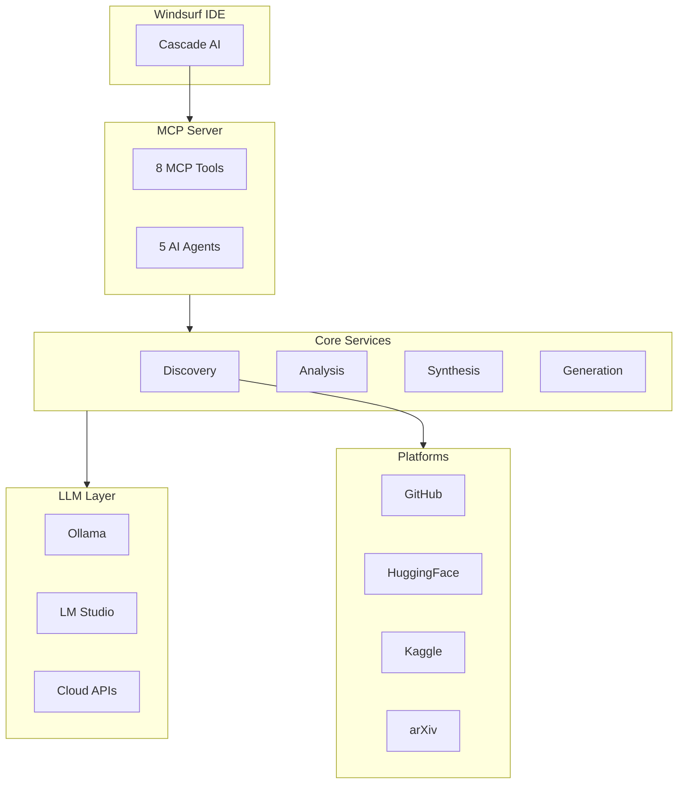

<div align="center">

# 🧬 AI Project Synthesizer

### Intelligent Multi-Repository Code Synthesis Platform

[](https://opensource.org/licenses/MIT)
[](https://www.python.org/downloads/)
[](https://modelcontextprotocol.io/)
[](https://windsurf.ai/)
[](tests/)
[](CHANGELOG.md)

**Transform hours of research into minutes of intelligent synthesis**

[Quick Start](#-quick-start) •
[Features](#-features) •
[Documentation](#-documentation) •
[API Reference](docs/API_REFERENCE.md)

</div>

---

## 🎯 What Is This?

The **AI Project Synthesizer** is a production-ready MCP (Model Context Protocol) server that revolutionizes how developers start new projects. It automatically:

- 🔍 **Discovers** relevant code across GitHub, HuggingFace, Kaggle, and arXiv
- 🔬 **Analyzes** code structure, dependencies, and compatibility
- 🔧 **Synthesizes** multiple repositories into unified, working projects
- 📝 **Generates** comprehensive documentation automatically

<details>
<summary><b>📊 Project Stats</b></summary>

| Metric | Value |
|--------|-------|
| Version | 2.0.0 |
| Tests | 245+ passing |
| MCP Tools | 8 |
| AI Agents | 5 |
| n8n Workflows | 10 |
| Platforms | 4 (GitHub, HuggingFace, Kaggle, arXiv) |

</details>

---

## ✨ Features

<table>
<tr>
<td width="50%">

### 🔍 Discovery
- **Multi-Platform Search** - GitHub, HuggingFace, Kaggle, arXiv
- **Smart Filtering** - Stars, language, license, activity
- **Trend Analysis** - Find trending repositories
- **Bookmark Management** - Save favorites

</td>
<td width="50%">

### 🔬 Analysis
- **AST Parsing** - Tree-sitter for 100+ languages
- **Dependency Mapping** - Full dependency graphs
- **Compatibility Check** - Version conflict detection
- **Quality Scoring** - Code maintainability metrics

</td>
</tr>
<tr>
<td width="50%">

### 🔧 Synthesis
- **Smart Merging** - Combine multiple repos
- **Conflict Resolution** - SAT solver via `uv`
- **Selective Extraction** - Pull only what you need
- **Template Support** - Copier scaffolding

</td>
<td width="50%">

### 📝 Documentation
- **Auto README** - AI-powered generation
- **API Docs** - Auto-extracted from code
- **Diagrams** - Mermaid architecture diagrams
- **Dependency Viz** - Visual dependency graphs

</td>
</tr>
<tr>
<td width="50%">

### 🤖 AI Agents
- **ResearchAgent** - Repository discovery
- **SynthesisAgent** - Code merging
- **VoiceAgent** - Voice commands
- **AutomationAgent** - Task scheduling
- **CodeAgent** - Code analysis

</td>
<td width="50%">

### 🎤 Voice System
- **ElevenLabs TTS** - High-quality speech
- **Voice Commands** - Natural language control
- **Push-to-Talk** - Hotkey activation
- **Continuous Mode** - Always listening

</td>
</tr>
<tr>
<td width="50%">

### 🖥️ Terminal UI
- **Rich Dashboard** - System overview
- **Interactive Search** - Browse repositories
- **Agent Control** - Manage AI agents
- **Settings Panel** - Configuration UI

</td>
<td width="50%">

### ⚡ Automation
- **10 n8n Workflows** - Ready-to-use templates
- **Webhook Support** - GitHub, Slack, Discord
- **Event System** - Real-time SSE streaming
- **Gap Analyzer** - Auto-repair issues

</td>
</tr>
</table>

---

## 🚀 Quick Start

### Installation

```bash
# Clone the repository
git clone https://github.com/Ghenghis/AI-Project-Synthesizer.git
cd AI-Project-Synthesizer

# Install dependencies
pip install -r requirements.txt

# Configure environment
cp .env.example .env
# Edit .env and add your GITHUB_TOKEN
```

### Start the Server

```bash
# Option 1: MCP Server (for Windsurf IDE)
python -m src.mcp_server.server

# Option 2: Terminal UI
python -m src.cli tui

# Option 3: Web Dashboard
python -m src.cli dashboard

# Option 4: Voice Assistant
python -m src.cli voice
```

### Windsurf IDE Integration

Add to `~/.codeium/windsurf/mcp_config.json`:

```json
{
  "mcpServers": {
    "ai-synthesizer": {
      "command": "python",
      "args": ["-m", "src.mcp_server.server"],
      "cwd": "/path/to/AI-Project-Synthesizer"
    }
  }
}
```

---

## 🛠️ CLI Commands

| Command | Description |
|---------|-------------|
| `python -m src.cli serve` | Start MCP server |
| `python -m src.cli tui` | Start Terminal UI |
| `python -m src.cli dashboard` | Start web dashboard |
| `python -m src.cli voice` | Start voice assistant |
| `python -m src.cli search "query"` | Search repositories |
| `python -m src.cli check` | Run gap analysis |
| `python -m src.cli settings` | Manage settings |
| `python -m src.cli health` | Check system health |

---

## 🏗️ Architecture



---

## 📚 Documentation

<table>
<tr>
<td>

### 📖 Core Docs
- [API Reference](docs/API_REFERENCE.md)
- [Architecture](docs/architecture/ARCHITECTURE.md)
- [Diagrams](docs/diagrams/DIAGRAMS.md)
- [Features](FEATURES.md)
- [Changelog](CHANGELOG.md)

</td>
<td>

### 📘 Guides
- [Quick Start](docs/guides/QUICK_START.md)
- [User Guide](docs/guides/USER_GUIDE.md)
- [Configuration](docs/guides/CONFIGURATION.md)
- [CLI Reference](docs/guides/CLI_REFERENCE.md)
- [Troubleshooting](docs/guides/TROUBLESHOOTING.md)

</td>
<td>

### 🔌 Integration
- [MCP Setup](docs/MCP_SETUP_GUIDE.md)
- [MCP Clients](docs/MCP_CLIENT_SUPPORT.md)
- [Enterprise](docs/ENTERPRISE_DEPLOYMENT.md)

</td>
</tr>
</table>

---

## 🛠️ MCP Tools (Complete Reference)

<details>
<summary><b>search_repositories</b> - Multi-platform repository search</summary>

```python
# Parameters
query: str              # Search query (required)
platforms: list         # ["github", "huggingface", "kaggle", "arxiv"]
max_results: int        # Maximum results per platform (default: 10)
min_stars: int          # Minimum stars filter (default: 0)
language: str           # Filter by language (e.g., "python")
license: str            # Filter by license (e.g., "mit")
sort_by: str            # "stars", "updated", "relevance"

# Example
search_repositories(
    query="machine learning framework",
    platforms=["github", "huggingface"],
    min_stars=1000,
    language="python"
)
```
</details>

<details>
<summary><b>analyze_repository</b> - Deep code analysis</summary>

```python
# Parameters
repo_url: str                    # Repository URL (required)
include_transitive_deps: bool    # Include transitive dependencies
extract_components: bool         # Extract reusable components
analyze_quality: bool            # Run quality scoring
max_depth: int                   # Dependency tree depth

# Returns
{
    "structure": {...},          # File/folder structure
    "dependencies": [...],       # Direct dependencies
    "transitive_deps": [...],    # All dependencies
    "components": [...],         # Extractable components
    "quality_score": 0.85,       # Code quality (0-1)
    "languages": {"python": 80}, # Language breakdown
    "license": "MIT"
}
```
</details>

<details>
<summary><b>check_compatibility</b> - Multi-repo compatibility check</summary>

```python
# Parameters
repo_urls: list                  # List of repository URLs
target_python_version: str       # Target Python version (e.g., "3.11")
check_licenses: bool             # Check license compatibility
check_dependencies: bool         # Check dependency conflicts

# Returns
{
    "compatible": true,
    "conflicts": [],
    "warnings": [...],
    "license_compatible": true,
    "suggested_python": "3.11"
}
```
</details>

<details>
<summary><b>resolve_dependencies</b> - Dependency resolution</summary>

```python
# Parameters
repositories: list               # Repository URLs or local paths
constraints: dict                # Version constraints
python_version: str              # Target Python version
strategy: str                    # "strict", "flexible", "latest"

# Returns
{
    "resolved": {...},           # Resolved versions
    "conflicts": [],             # Unresolvable conflicts
    "lockfile": "...",           # Generated lockfile content
}
```
</details>

<details>
<summary><b>synthesize_project</b> - Create unified project</summary>

```python
# Parameters
repositories: list               # Source repositories
project_name: str                # Output project name
output_path: str                 # Where to create project
template: str                    # Template to use
include_tests: bool              # Include test files
include_docs: bool               # Include documentation
merge_strategy: str              # "copy", "merge", "selective"

# Returns
{
    "synthesis_id": "...",       # Job ID for tracking
    "status": "started",
    "output_path": "/path/to/project"
}
```
</details>

<details>
<summary><b>generate_documentation</b> - Auto-generate docs</summary>

```python
# Parameters
project_path: str                # Project to document
doc_types: list                  # ["readme", "api", "diagrams", "changelog"]
llm_enhanced: bool               # Use LLM for better descriptions
output_format: str               # "markdown", "html", "rst"
include_examples: bool           # Generate usage examples

# Returns
{
    "files_generated": [...],
    "readme_path": "...",
    "api_docs_path": "..."
}
```
</details>

<details>
<summary><b>get_synthesis_status</b> - Check job progress</summary>

```python
# Parameters
synthesis_id: str                # Job ID from synthesize_project

# Returns
{
    "status": "completed",       # pending, running, completed, failed
    "progress": 100,
    "current_step": "done",
    "output_path": "/path/to/project",
    "errors": []
}
```
</details>

<details>
<summary><b>get_platforms</b> - Platform information</summary>

```python
# No parameters required

# Returns
{
    "platforms": [
        {"name": "github", "status": "healthy", "rate_limit": {...}},
        {"name": "huggingface", "status": "healthy"},
        {"name": "kaggle", "status": "healthy"},
        {"name": "arxiv", "status": "healthy"}
    ]
}
```
</details>

---

## 🤖 AI Agents (Detailed)

<details>
<summary><b>ResearchAgent</b> - Repository Discovery</summary>

**Purpose:** Automatically discover and evaluate repositories

**Tools:**
- `search_platforms` - Multi-platform search
- `get_trends` - Trending repositories
- `evaluate_repo` - Quality assessment
- `find_similar` - Find similar projects

**Example:**
```python
from src.agents import ResearchAgent

agent = ResearchAgent()
results = await agent.run({
    "task": "find best Python web frameworks",
    "min_stars": 5000,
    "max_results": 10
})
```
</details>

<details>
<summary><b>SynthesisAgent</b> - Code Merging</summary>

**Purpose:** Merge multiple repositories into unified projects

**Tools:**
- `analyze_repos` - Analyze source repositories
- `resolve_conflicts` - Resolve dependency conflicts
- `merge_code` - Merge code intelligently
- `generate_config` - Generate project configuration

**Example:**
```python
from src.agents import SynthesisAgent

agent = SynthesisAgent()
result = await agent.run({
    "repositories": ["repo1_url", "repo2_url"],
    "output_name": "my_project",
    "strategy": "selective"
})
```
</details>

<details>
<summary><b>VoiceAgent</b> - Voice Interaction</summary>

**Purpose:** Voice-controlled assistant

**Commands:**
- "Search for [query]" - Search repositories
- "Create project [name]" - Start synthesis
- "Show status" - Current status
- "Open settings" - Open settings
- "Stop listening" - Pause voice

**Modes:**
- `push_to_talk` - Hold hotkey to speak
- `continuous` - Always listening
- `disabled` - Voice off
</details>

<details>
<summary><b>AutomationAgent</b> - Task Scheduling</summary>

**Purpose:** Automate recurring tasks

**Tools:**
- `schedule_task` - Schedule a task
- `run_workflow` - Execute n8n workflow
- `monitor_health` - Health monitoring
- `recover_component` - Auto-recovery

**Example:**
```python
from src.agents import AutomationAgent

agent = AutomationAgent()
await agent.schedule_task({
    "name": "daily_research",
    "cron": "0 9 * * *",
    "action": "search_trending"
})
```
</details>

<details>
<summary><b>CodeAgent</b> - Code Analysis</summary>

**Purpose:** Analyze and refactor code

**Tools:**
- `analyze_code` - Deep code analysis
- `find_issues` - Find code issues
- `suggest_refactoring` - Refactoring suggestions
- `generate_tests` - Generate test cases
</details>

---

## ⚙️ Settings (All Options)

<details>
<summary><b>General Settings</b></summary>

| Setting | Type | Default | Description |
|---------|------|---------|-------------|
| `theme` | string | "dark" | UI theme (dark/light) |
| `language` | string | "en" | Interface language |
| `auto_save` | bool | true | Auto-save settings |
| `notifications` | bool | true | Show notifications |
| `telemetry` | bool | false | Anonymous usage data |
| `log_level` | string | "INFO" | Logging level |
</details>

<details>
<summary><b>Voice Settings</b></summary>

| Setting | Type | Default | Description |
|---------|------|---------|-------------|
| `mode` | enum | "push_to_talk" | Voice mode |
| `provider` | string | "elevenlabs" | TTS provider |
| `voice_id` | string | "rachel" | Voice selection |
| `speed` | float | 1.0 | Speech speed (0.5-2.0) |
| `stability` | float | 0.5 | Voice stability |
| `hotkey` | string | "ctrl+shift+v" | Activation hotkey |
| `auto_play` | bool | true | Auto-play responses |
| `streaming` | bool | true | Stream audio |
</details>

<details>
<summary><b>Automation Settings</b></summary>

| Setting | Type | Default | Description |
|---------|------|---------|-------------|
| `auto_continue_mode` | enum | "smart" | Auto-continue behavior |
| `max_iterations` | int | 10 | Max auto-continue steps |
| `pause_on_error` | bool | true | Pause on errors |
| `n8n_url` | string | "http://localhost:5678" | n8n server URL |
| `enable_webhooks` | bool | true | Enable webhooks |
</details>

<details>
<summary><b>Hotkey Settings</b></summary>

| Action | Default Hotkey | Description |
|--------|----------------|-------------|
| `voice_toggle` | Ctrl+Shift+V | Toggle voice |
| `voice_push_to_talk` | Ctrl+Space | Push-to-talk |
| `quick_search` | Ctrl+Shift+S | Quick search |
| `open_dashboard` | Ctrl+Shift+D | Open dashboard |
| `toggle_agent` | Ctrl+Shift+A | Toggle agent |
| `emergency_stop` | Ctrl+Shift+X | Stop all |
</details>

<details>
<summary><b>AI/ML Settings</b></summary>

| Setting | Type | Default | Description |
|---------|------|---------|-------------|
| `primary_provider` | string | "ollama" | Primary LLM |
| `fallback_provider` | string | "openai" | Fallback LLM |
| `model` | string | "qwen2.5-coder:14b" | Model name |
| `temperature` | float | 0.7 | Generation temperature |
| `max_tokens` | int | 4096 | Max output tokens |
| `context_window` | int | 32768 | Context size |
</details>

---

## 🔗 Webhook Endpoints

| Endpoint | Method | Description |
|----------|--------|-------------|
| `/api/webhooks/github` | POST | GitHub events |
| `/api/webhooks/n8n/{workflow}` | POST | n8n workflow triggers |
| `/api/webhooks/slack` | POST | Slack commands |
| `/api/webhooks/discord` | POST | Discord bot |
| `/api/webhooks/custom/{hook_id}` | POST | Custom webhooks |

---

## 📡 API Endpoints

| Endpoint | Method | Description |
|----------|--------|-------------|
| `/api/health` | GET | Health check |
| `/api/version` | GET | Version info |
| `/api/settings` | GET/PUT | Settings management |
| `/api/agents/status` | GET | Agent status |
| `/api/memory` | GET/POST | Memory operations |
| `/api/bookmarks` | GET/POST/DELETE | Bookmark management |
| `/api/search-history` | GET/POST | Search history |
| `/api/events/stream` | GET (SSE) | Real-time events |

---

## 🔄 n8n Workflows

| Workflow | Trigger | Description |
|----------|---------|-------------|
| `01_project_synthesis` | Webhook | Full synthesis pipeline |
| `02_scheduled_research` | Cron | Daily trending repos |
| `03_health_monitoring` | Cron | System health checks |
| `04_voice_assistant` | Webhook | Voice command handler |
| `05_integration_tests` | Webhook | Run test suite |
| `06_full_system_test` | Webhook | Complete validation |
| `07_agent_orchestration` | Webhook | Multi-agent tasks |
| `08_code_review` | Webhook | AI code review |
| `09_documentation_generator` | Webhook | Auto-generate docs |
| `10_bookmark_sync` | Cron | Sync bookmarks |

---

## 🌐 Environment Variables

| Variable | Required | Description |
|----------|----------|-------------|
| `GITHUB_TOKEN` | Yes | GitHub API token |
| `ELEVENLABS_API_KEY` | No | ElevenLabs TTS |
| `OPENAI_API_KEY` | No | OpenAI fallback |
| `ANTHROPIC_API_KEY` | No | Anthropic fallback |
| `HUGGINGFACE_TOKEN` | No | HuggingFace access |
| `KAGGLE_USERNAME` | No | Kaggle API |
| `KAGGLE_KEY` | No | Kaggle API key |
| `OLLAMA_HOST` | No | Ollama URL (default: localhost:11434) |
| `LMSTUDIO_HOST` | No | LM Studio URL (default: localhost:1234) |
| `N8N_URL` | No | n8n server URL |

---

## 📊 System Requirements

| Component | Minimum | Recommended |
|-----------|---------|-------------|
| Python | 3.11+ | 3.12+ |
| RAM | 16 GB | 32+ GB |
| GPU VRAM | 8 GB | 24 GB |
| Storage | 50 GB | 100+ GB SSD |

---

## 🧪 Testing

```bash
# Run all tests
pytest tests/ -v

# Run with coverage
pytest tests/ --cov=src --cov-report=html

# Run system tests
python test_system.py

# Run gap analysis
python -m src.cli check
```

---

## 🤝 Contributing

Contributions are welcome! Please see [CONTRIBUTING.md](CONTRIBUTING.md) for guidelines.

```bash
# Development setup
pip install -r requirements-dev.txt

# Run linting
ruff check src/ --fix
ruff format src/

# Type checking
mypy src/
```

---

## 📄 License

This project is licensed under the MIT License - see [LICENSE](LICENSE) for details.

---

<div align="center">

### 🙏 Acknowledgments

Built with [Tree-sitter](https://tree-sitter.github.io/) • [uv](https://github.com/astral-sh/uv) • [Ollama](https://ollama.ai/) • [FastMCP](https://github.com/jlowin/fastmcp) • [Rich](https://github.com/Textualize/rich)

**Made with ❤️ for the Windsurf community**

[⬆ Back to Top](#-ai-project-synthesizer)

</div>

---

<details>
<summary><b>📁 Project Structure</b></summary>

```
AI_Synthesizer/
├── src/
│   ├── agents/              # 5 AI Agents
│   ├── analysis/            # Code analysis (AST, dependencies)
│   ├── automation/          # n8n workflows, metrics
│   ├── core/                # Config, cache, health, memory
│   ├── dashboard/           # FastAPI web dashboard
│   ├── discovery/           # Platform clients (GitHub, HF, etc.)
│   ├── generation/          # Documentation generation
│   ├── llm/                 # LLM providers (Ollama, LM Studio)
│   ├── mcp_server/          # MCP server and tools
│   ├── resolution/          # Dependency resolution
│   ├── synthesis/           # Project synthesis
│   ├── tui/                 # Terminal UI (Rich)
│   ├── voice/               # Voice system (ElevenLabs)
│   └── workflows/           # Workflow orchestration
├── tests/                   # 245+ tests
├── docs/                    # Documentation
├── config/                  # Configuration files
├── scripts/                 # Automation scripts
└── docker/                  # Docker configuration
```

</details>
