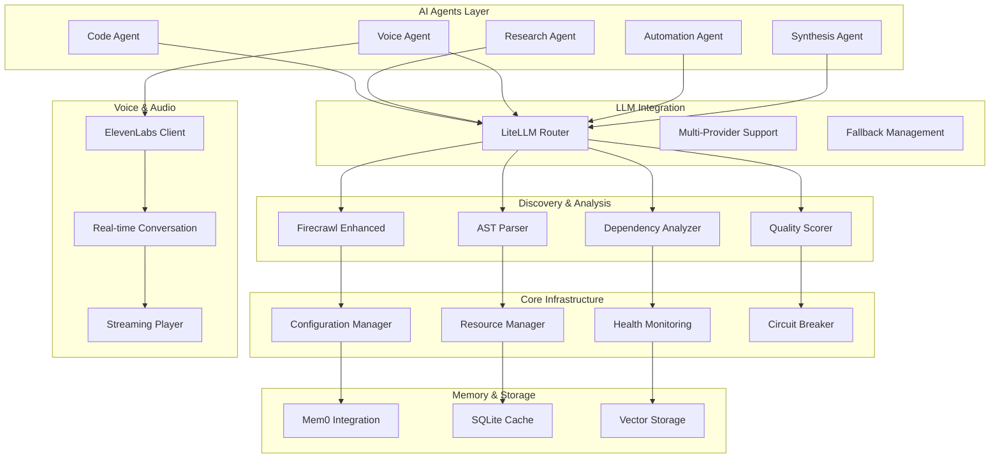

<div align="center">

# 🚀 AI Project Synthesizer

[](https://opensource.org/licenses/MIT)
[](https://www.python.org/downloads/)
[](https://github.com/psf/black)
[](https://mypy.readthedocs.io/)
[](https://pytest.org/)

<!-- Animated Logo SVG -->
<svg width="400" height="200" viewBox="0 0 400 200" xmlns="http://www.w3.org/2000/svg">
  <defs>
    <linearGradient id="logoGradient" x1="0%" y1="0%" x2="100%" y2="100%">
      <stop offset="0%" style="stop-color:#667eea;stop-opacity:1">
        <animate attributeName="stop-color" values="#667eea;#764ba2;#f093fb;#667eea" dur="4s" repeatCount="indefinite" />
      </stop>
      <stop offset="100%" style="stop-color:#764ba2;stop-opacity:1">
        <animate attributeName="stop-color" values="#764ba2;#f093fb;#667eea;#764ba2" dur="4s" repeatCount="indefinite" />
      </stop>
    </linearGradient>
    
    <filter id="glow">
      <feGaussianBlur stdDeviation="3" result="coloredBlur"/>
      <feMerge>
        <feMergeNode in="coloredBlur"/>
        <feMergeNode in="SourceGraphic"/>
      </feMerge>
    </filter>
  </defs>
  
  <!-- Neural Network Animation -->
  <g transform="translate(200, 100)">
    <!-- Central Core -->
    <circle cx="0" cy="0" r="20" fill="url(#logoGradient)" filter="url(#glow)">
      <animate attributeName="r" values="20;25;20" dur="2s" repeatCount="indefinite" />
    </circle>
    
    <!-- Orbiting Modules -->
    <g>
      <animateTransform attributeName="transform" type="rotate" from="0 0 0" to="360 0 0" dur="20s" repeatCount="indefinite" />
      <circle cx="60" cy="0" r="10" fill="#667eea" opacity="0.8">
        <animate attributeName="opacity" values="0.8;1;0.8" dur="2s" repeatCount="indefinite" />
      </circle>
      <circle cx="-60" cy="0" r="10" fill="#764ba2" opacity="0.8">
        <animate attributeName="opacity" values="0.8;1;0.8" dur="2s" begin="0.5s" repeatCount="indefinite" />
      </circle>
      <circle cx="0" cy="60" r="10" fill="#f093fb" opacity="0.8">
        <animate attributeName="opacity" values="0.8;1;0.8" dur="2s" begin="1s" repeatCount="indefinite" />
      </circle>
      <circle cx="0" cy="-60" r="10" fill="#4facfe" opacity="0.8">
        <animate attributeName="opacity" values="0.8;1;0.8" dur="2s" begin="1.5s" repeatCount="indefinite" />
      </circle>
    </g>
    
    <!-- Connection Lines -->
    <line x1="0" y1="0" x2="60" y2="0" stroke="#667eea" stroke-width="2" opacity="0.5">
      <animate attributeName="opacity" values="0.5;1;0.5" dur="2s" repeatCount="indefinite" />
    </line>
    <line x1="0" y1="0" x2="-60" y2="0" stroke="#764ba2" stroke-width="2" opacity="0.5">
      <animate attributeName="opacity" values="0.5;1;0.5" dur="2s" begin="0.5s" repeatCount="indefinite" />
    </line>
    <line x1="0" y1="0" x2="0" y2="60" stroke="#f093fb" stroke-width="2" opacity="0.5">
      <animate attributeName="opacity" values="0.5;1;0.5" dur="2s" begin="1s" repeatCount="indefinite" />
    </line>
    <line x1="0" y1="0" x2="0" y2="-60" stroke="#4facfe" stroke-width="2" opacity="0.5">
      <animate attributeName="opacity" values="0.5;1;0.5" dur="2s" begin="1.5s" repeatCount="indefinite" />
    </line>
  </g>
  
  <!-- Title Text -->
  <text x="200" y="180" font-family="Arial, sans-serif" font-size="24" font-weight="bold" text-anchor="middle" fill="url(#logoGradient)">
    AI Project Synthesizer
  </text>
</svg>

## 🌟 The Ultimate AI-Powered Development Ecosystem

> **Transform your ideas into production-ready applications with the power of aggregated AI intelligence**

</div>

---

## 📊 Project Statistics

| Metric | Value |
|--------|-------|
| 📁 **Total Files** | 141+ |
| 🏗️ **Classes** | 461+ |
| ⚡ **Functions** | 1,888+ |
| 📦 **Modules** | 20+ Categories |
| 🤖 **AI Providers** | 6+ Integrated |
| 🔌 **Platforms** | GitHub, HuggingFace, Kaggle, Supabase |

---

## 🎯 Quick Start

```bash
# Clone the repository
git clone https://github.com/yourusername/ai-project-synthesizer.git
cd ai-project-synthesizer

# Create virtual environment
python -m venv .venv
source .venv/bin/activate  # On Windows: .venv\Scripts\activate

# Install dependencies
pip install -r requirements.txt

# Run the synthesizer
python -m src.cli --help
```

---

## 🏗️ Architecture Overview

<details>
<summary>📖 Click to explore the complete architecture</summary>

### Core Components



</details>

---

## 🚀 Feature Modules

<details open>
<summary>🤖 <strong>AI Agents</strong> - Intelligent automation at scale</summary>

### Multi-Framework Agent Support
- **AutoGen Integration** - Multi-agent conversations
- **CrewAI Integration** - Role-based agent teams
- **LangGraph Integration** - Complex workflow orchestration
- **Swarm Integration** - Lightweight agent coordination

### Specialized Agents
- **Code Agent** - Generate, review, and refactor code
- **Research Agent** - Gather and synthesize information
- **Voice Agent** - Natural language interactions
- **Automation Agent** - Workflow automation
- **Synthesis Agent** - Combine multiple AI outputs

</details>

<details>
<summary>🔍 <strong>Discovery & Analysis</strong> - Understand any codebase</summary>

### Web Scraping & Content Extraction
- **Firecrawl Enhanced** - Advanced web scraping with caching
- **Content Extraction** - AI-powered content summarization
- **Rate Limiting** - Intelligent request management
- **Browser Automation** - Fallback scraping methods

### Code Analysis Tools
- **AST Parser** - Deep code structure analysis
- **Dependency Analyzer** - Map project dependencies
- **Quality Scorer** - Automated code quality assessment
- **Compatibility Checker** - Version and environment validation

</details>

<details>
<summary>🧠 <strong>LLM Integration</strong> - Unified AI model access</summary>

### Multi-Provider Support
- **OpenAI** - GPT-4, GPT-3.5, and latest models
- **Anthropic** - Claude 3 family
- **xAI** - Grok models
- **Google** - Gemini models
- **Local Models** - Ollama and LM Studio support

### Advanced Features
- **Smart Routing** - Automatic model selection
- **Token Management** - Usage optimization
- **Fallback Handling** - Graceful degradation
- **Response Caching** - Performance optimization

</details>

<details>
<summary>🎤 <strong>Voice & Audio</strong> - Natural voice interactions</summary>

### Text-to-Speech
- **ElevenLabs Integration** - Premium voice synthesis
- **Multiple Voices** - 9+ pre-configured voices
- **Real-time Streaming** - Low-latency audio
- **Voice Cloning** - Custom voice creation

### Speech Recognition
- **GLM ASR** - High-accuracy transcription
- **Real-time Processing** - Live conversation support
- **Multiple Languages** - International language support

</details>

<details>
<summary>💾 <strong>Memory & Storage</strong> - Persistent intelligence</summary>

### Memory Systems
- **Mem0 Integration** - Advanced memory management
- **Conversation History** - Context preservation
- **Knowledge Base** - Structured information storage
- **Vector Search** - Semantic memory retrieval

### Caching & Performance
- **Multi-level Caching** - Memory, disk, and hybrid
- **SQLite Backend** - Persistent cache storage
- **TTL Management** - Automatic cache expiration
- **Cache Invalidation** - Smart cache updates

</details>

<details>
<summary>🔧 <strong>Core Infrastructure</strong> - Rock-solid foundation</summary>

### System Management
- **Configuration Manager** - Centralized settings
- **Resource Manager** - Memory and CPU optimization
- **Health Monitoring** - System health checks
- **Lifecycle Management** - Graceful startup/shutdown

### Reliability Features
- **Circuit Breaker** - Fault tolerance
- **Auto-Repair** - Self-healing mechanisms
- **Observability** - Comprehensive logging
- **Error Recovery** - Graceful error handling

</details>

<details>
<summary>📊 <strong>Quality & Testing</strong> - Ensure excellence</summary>

### Code Quality
- **Automated Testing** - Comprehensive test suite
- **Code Coverage** - 80%+ coverage target
- **Linting & Formatting** - Consistent code style
- **Type Checking** - Static type validation

### Quality Metrics
- **Complexity Analysis** - Code complexity tracking
- **Performance Profiling** - Identify bottlenecks
- **Security Scanning** - Vulnerability detection
- **Documentation Coverage** - Complete API docs

</details>

---

## 🌐 Ecosystem Integration

<details>
<summary>🔗 Platform Integrations</summary>

### Development Platforms
- **GitHub** - Repository management and analysis
- **HuggingFace** - Model and dataset discovery
- **Kaggle** - Competition and dataset access
- **Supabase** - Database and backend services

### Automation Tools
- **N8N Workflows** - Visual workflow automation
- **Browser Automation** - Web interaction automation
- **CLI Tools** - Command-line interface
- **API Integrations** - RESTful service connections

</details>

---

## 🎨 Real-World Use Cases

### 🏢 Enterprise Applications
```python
# Automated code review and enhancement
from src.agents import CodeAgent
from src.analysis import QualityScorer

agent = CodeAgent()
code = "your_code_here"
review = await agent.review_code(code)
score = QualityScorer().analyze(code)
```

### 🎓 Educational Tools
```python
# Interactive learning assistant
from src.voice import VoiceManager
from src.llm import LiteLLMRouter

voice = VoiceManager()
llm = LiteLLMRouter()
await voice.speak("Welcome to your AI tutor!")
```

### 🚀 Startup MVP Development
```python
# Rapid prototyping with AI
from src.synthesis import ProjectBuilder
from src.discovery import FirecrawlEnhanced

builder = ProjectBuilder()
scraper = FirecrawlEnhanced()
mvp = await builder.build_from_description("Build a todo app")
```

---

## 📚 Documentation

| Document | Description |
|----------|-------------|
| [📖 Getting Started](docs/getting-started.md) | Complete setup and installation guide |
| [🔧 API Reference](docs/api-reference.md) | Detailed API documentation |
| [🎯 Tutorials](docs/tutorials.md) | Step-by-step tutorials |
| [🏗️ Architecture](docs/architecture.md) | Deep dive into system architecture |
| [❓ FAQ](docs/faq.md) | Frequently asked questions |
| [🤝 Contributing](docs/contributing.md) | How to contribute to the project |

---

## 🛠️ Development Status


### Current Progress
- ✅ Core agent framework
- ✅ Multi-LLM integration
- ✅ Voice synthesis
- ✅ Web scraping
- ✅ Memory management
- 🚀 Advanced features in development
- 📊 Performance optimization
- 🌐 Cloud deployment

---

## 🤝 Contributing

We welcome contributions! Please see our [Contributing Guide](docs/contributing.md) for details.

### Quick Contribution Steps
1. Fork the repository
2. Create a feature branch
3. Make your changes
4. Add tests
5. Submit a pull request

---

## 📄 License

This project is licensed under the MIT License - see the [LICENSE](LICENSE) file for details.

---

## 🙏 Acknowledgments

- OpenAI for GPT models
- Anthropic for Claude models
- ElevenLabs for voice synthesis
- The open-source community
- All our contributors

---

<div align="center">

**⭐ Star this repository if it helped you!**

Made with ❤️ by the AI Project Synthesizer Team

</div>
