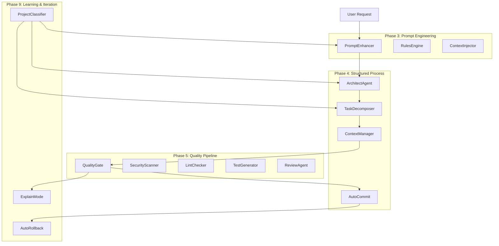

# Vibe Coding Automation Documentation

## Overview

Vibe Coding Automation is a comprehensive pipeline that transforms natural language requests into production-ready code while maintaining quality, security, and best practices. It combines prompt engineering, structured process management, quality assurance, and learning capabilities.

## Architecture



## Components

### Phase 3: Prompt Engineering Automation

#### PromptEnhancer
Automatically enhances user prompts with:
- **Context Layer**: Project type, tech stack, existing components
- **Task Layer**: Clear, actionable instructions
- **Constraints Layer**: Security, style, and pattern requirements

```python
from src.vibe import PromptEnhancer

enhancer = PromptEnhancer()
enhanced = await enhancer.enhance(
    "Add user authentication",
    {"project_type": "web_api", "tech_stack": ["Python", "FastAPI"]}
)
```

#### RulesEngine
Manages coding rules and constraints:
- YAML-based rule definitions
- Priority-based conflict resolution
- Dynamic rule injection into prompts

```python
from src.vibe import RulesEngine

engine = RulesEngine()
await engine.load_rules("rules/python_api.yaml")
rules = engine.get_rules("python", "web_api")
```

#### ContextInjector
Provides project context:
- Automatic project type detection
- Component discovery
- Git status and recent changes
- Environment information

### Phase 4: Structured Process

#### ArchitectAgent
Creates architectural plans:
- Pattern detection (MVC, microservices, etc.)
- Component identification
- Data flow modeling
- Technology recommendations

```python
from src.vibe import ArchitectAgent

architect = ArchitectAgent()
plan = await architect.create_architecture(
    "Build a todo API",
    {"project_type": "web_api"}
)
```

#### TaskDecomposer
Breaks complex requests into phases:
- LLM-powered decomposition
- Dependency tracking
- Effort estimation
- Success criteria definition

```python
from src.vibe import TaskDecomposer

decomposer = TaskDecomposer()
task_plan = await decomposer.decompose(
    "Build a todo API with auth",
    arch_plan
)
```

#### ContextManager
Tracks state across phases:
- Phase lifecycle management
- Checkpoint creation/restoration
- Progress monitoring
- Mem0 persistence

```python
from src.vibe import ContextManager

manager = ContextManager()
context = await manager.create_context(task_plan)
await manager.start_phase(context.task_id, "phase_1")
```

#### AutoCommit
Automates Git commits:
- Configurable commit strategies
- Structured commit messages
- Branch management
- Commit history tracking

```python
from src.vibe import AutoCommit

committer = AutoCommit()
result = await committer.commit_phase(
    task_id="task_001",
    phase_id="phase_1",
    phase_name="Setup project"
)
```

### Phase 5: Quality Pipeline

#### SecurityScanner
Security vulnerability detection:
- Semgrep integration for static analysis
- Bandit for Python security issues
- CVE scanning in dependencies
- Risk assessment and reporting

```python
from src.quality import SecurityScanner

scanner = SecurityScanner()
result = await scanner.scan("src/", scanners=["semgrep", "bandit"])
```

#### LintChecker
Code style and quality:
- Multi-tool support (Ruff, ESLint, MyPy, Prettier)
- Auto-fix capabilities
- Custom rule configuration
- Quality metrics

```python
from src.quality import LintChecker

checker = LintChecker()
result = await checker.check("src/", auto_fix=True)
```

#### TestGenerator
Automated test creation:
- Pytest generation for Python
- Jest generation for JavaScript
- Coverage analysis
- Test scenario identification

```python
from src.quality import TestGenerator

generator = TestGenerator()
tests = await generator.generate_tests("src/api.py")
```

#### ReviewAgent
Multi-agent code review:
- AutoGen-based review debates
- Role-based reviewers
- Issue classification
- Improvement suggestions

```python
from src.quality import ReviewAgent

reviewer = ReviewAgent()
report = await reviewer.review_code("src/api.py")
```

#### QualityGate
Unified quality decisions:
- Pass/fail determination
- Auto-fix loops
- Quality scoring
- Gate configuration

```python
from src.quality import QualityGate

gate = QualityGate()
result = await gate.evaluate(code, context)
if not result.passed:
    # Handle failure
    pass
```

### Phase 9: Learning & Iteration

#### AutoRollback
Automatic recovery on failures:
- Multiple rollback strategies
- Checkpoint integration
- Pattern learning
- Configurable modes

```python
from src.vibe import AutoRollback, RollbackMode

rollback = AutoRollback(mode=RollbackMode.AUTO)
point = await rollback.create_rollback_point(task_id, phase_id)
result = await rollback.rollback_on_failure(task_id, phase_id, error)
```

#### ExplainMode
Code decision explanations:
- Multiple explanation types
- Configurable detail levels
- Impact analysis
- Best practice references

```python
from src.vibe import ExplainMode, ExplanationLevel

explainer = ExplainMode()
explanation = await explainer.explain_code_change(
    change, context, ExplanationLevel.DETAILED
)
```

#### ProjectClassifier
Automatic project analysis:
- Type detection
- Stack identification
- Pattern recognition
- Recommendations

```python
from src.vibe import ProjectClassifier

classifier = ProjectClassifier()
characteristics = await classifier.classify_project(".")
recommendations = classifier.get_recommendations(characteristics)
```

## Pipeline Flow

### Complete Workflow Example

```python
from src.vibe import (
    PromptEnhancer, ArchitectAgent, TaskDecomposer,
    ContextManager, AutoCommit, AutoRollback
)
from src.quality import QualityGate

async def vibe_coding_pipeline(user_request: str):
    # 1. Enhance prompt with context
    enhancer = PromptEnhancer()
    enhanced_prompt = await enhancer.enhance(user_request, context)
    
    # 2. Create architectural plan
    architect = ArchitectAgent()
    arch_plan = await architect.create_architecture(enhanced_prompt, context)
    
    # 3. Decompose into phases
    decomposer = TaskDecomposer()
    task_plan = await decomposer.decompose(enhanced_prompt, arch_plan)
    
    # 4. Initialize context
    context_manager = ContextManager()
    task_context = await context_manager.create_context(task_plan)
    
    # 5. Process each phase
    for phase in task_plan.phases:
        # Create rollback point
        rollback = AutoRollback()
        rollback_point = await rollback.create_rollback_point(
            task_context.task_id, phase.id
        )
        
        try:
            # Start phase
            await context_manager.start_phase(
                task_context.task_id, phase.id
            )
            
            # Execute phase (code generation here)
            generated_code = await generate_code(phase.prompt)
            
            # Quality check
            quality_gate = QualityGate()
            quality_result = await quality_gate.evaluate(
                generated_code, context
            )
            
            if not quality_result.passed:
                raise Exception("Quality gate failed")
            
            # Complete phase
            await context_manager.complete_phase(
                task_context.task_id, phase.id
            )
            
            # Auto commit
            committer = AutoCommit()
            await committer.commit_phase(
                task_context.task_id, phase.id, phase.name
            )
            
        except Exception as e:
            # Rollback on failure
            await rollback.rollback_on_failure(
                task_context.task_id, phase.id, str(e), rollback_point
            )
            raise
    
    return task_context
```

## Configuration

### Environment Variables

```bash
# LLM Configuration
OPENAI_API_KEY=your_openai_key
ANTHROPIC_API_KEY=your_anthropic_key
OLLAMA_HOST=http://localhost:11434

# Memory System
MEM0_API_KEY=your_mem0_key

# Quality Tools
SEMGREP_APP_TOKEN=your_semgrep_token

# Git Configuration
GIT_AUTHOR_NAME="Vibe MCP"
GIT_AUTHOR_EMAIL="vibe@mcp.local"
```

### Rules Configuration

Create `rules/python_api.yaml`:

```yaml
name: "Python API Rules"
version: "1.0"
rules:
  - id: "security_auth"
    name: "Authentication Required"
    category: "security"
    priority: "high"
    description: "All API endpoints must have authentication"
    constraint: "Add @auth_required decorator to all endpoints"
  
  - id: "style_type_hints"
    name: "Type Hints Required"
    category: "style"
    priority: "medium"
    description: "All functions must have type hints"
    constraint: "Add type annotations to function parameters and return"
```

### Quality Gate Configuration

```python
# config/quality_gate.yaml
quality_gate:
  security:
    enabled: true
    fail_on_high: true
    fail_on_medium: false
    max_issues: 0
  
  lint:
    enabled: true
    tools: ["ruff", "mypy"]
    auto_fix: true
    max_warnings: 5
  
  tests:
    enabled: true
    min_coverage: 80
    require_unit_tests: true
  
  review:
    enabled: true
    min_reviewers: 2
    auto_approve_simple: true
```

## Best Practices

### 1. Prompt Engineering
- Be specific about requirements
- Include examples of desired output
- Specify constraints and non-functional requirements
- Reference existing components when applicable

### 2. Architecture
- Start with simple patterns
- Consider scalability from the beginning
- Document architectural decisions
- Use established patterns when possible

### 3. Quality
- Enable all quality checks in development
- Fix issues as they appear
- Maintain high test coverage
- Review security implications

### 4. Learning
- Enable explain mode for understanding
- Use project classifier for context
- Track rollback patterns
- Learn from quality failures

## Testing

### Running Tests

```bash
# Run smoke tests
python tests/integration/vibe_pipeline_smoke_test.py

# Run component tests
python tests/integration/test_vibe_components.py

# Run with real LLM (integration mode)
VIBE_TEST_MODE=integration python tests/integration/vibe_pipeline_smoke_test.py
```

### Test Coverage

The test suite covers:
- Component integration
- Pipeline flow
- Error handling
- Rollback scenarios
- Quality gate failures

## Troubleshooting

### Common Issues

1. **LLM API Failures**
   - Check API keys in `.env`
   - Verify network connectivity
   - Try fallback models

2. **Git Commit Failures**
   - Ensure Git repository is initialized
   - Check Git configuration
   - Verify file permissions

3. **Quality Gate Failures**
   - Review security scanner output
   - Check linting rules
   - Verify test coverage

4. **Memory System Issues**
   - Check Mem0 API key
   - Verify connection
   - Check quota limits

### Debug Mode

Enable debug logging:

```python
import logging
logging.basicConfig(level=logging.DEBUG)
```

## Contributing

### Adding New Components

1. Create component in appropriate phase directory
2. Follow established patterns
3. Add comprehensive tests
4. Update documentation
5. Update `__init__.py` exports

### Code Style

- Use type hints everywhere
- Follow PEP 8 for Python
- Write comprehensive docstrings
- Include error handling
- Add logging for debugging

## Roadmap

### Phase 8: Platform Integrations
- Enhanced GitLab integration
- Web scraping capabilities
- Browser automation
- Dependency vulnerability scanning

### Phase 10: Rebrand to VIBE MCP
- Repository rename
- Import updates
- Documentation refresh
- Migration guide

### Future Enhancements
- Multi-language support expansion
- Cloud deployment integration
- Advanced learning algorithms
- Real-time collaboration
