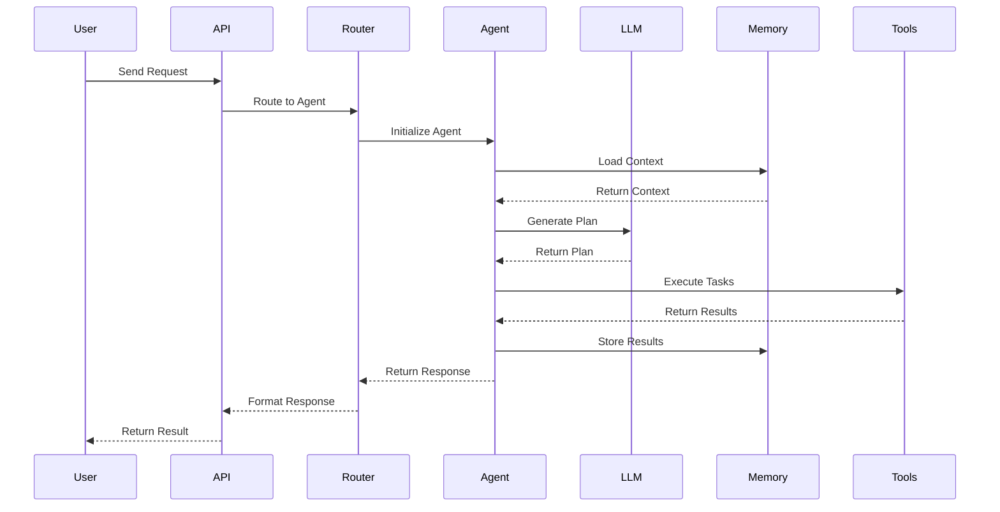
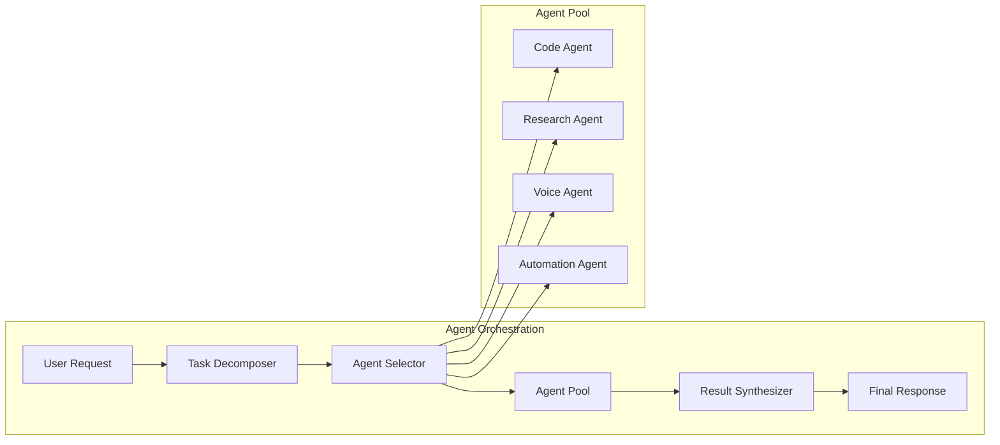

# 🏗️ Architecture Guide

This document provides a comprehensive overview of the AI Project Synthesizer architecture, including system design, component interactions, and technical decisions.

## Table of Contents

- [High-Level Architecture](#high-level-architecture)
- [Component Overview](#component-overview)
- [Data Flow](#data-flow)
- [Design Patterns](#design-patterns)
- [Technology Stack](#technology-stack)
- [Scalability Considerations](#scalability-considerations)
- [Security Architecture](#security-architecture)

---

## 🎯 High-Level Architecture

### System Overview

The AI Project Synthesizer is built on a modular, event-driven architecture that enables seamless integration of multiple AI providers, agents, and services. The system follows a layered approach:

```
┌─────────────────────────────────────────────────────────────┐
│                    Presentation Layer                       │
│  ┌─────────────┐  ┌─────────────┐  ┌─────────────┐        │
│  │    CLI      │  │   Dashboard │  │    API      │        │
│  └─────────────┘  └─────────────┘  └─────────────┘        │
└─────────────────────────────────────────────────────────────┘
┌─────────────────────────────────────────────────────────────┐
│                    Application Layer                        │
│  ┌─────────────┐  ┌─────────────┐  ┌─────────────┐        │
│  │   Agents    │  │  Workflows  │  │   Voice     │        │
│  └─────────────┘  └─────────────┘  └─────────────┘        │
└─────────────────────────────────────────────────────────────┘
┌─────────────────────────────────────────────────────────────┐
│                      Service Layer                          │
│  ┌─────────────┐  ┌─────────────┐  ┌─────────────┐        │
│  │   LLM       │  │ Discovery   │  │   Memory    │        │
│  │   Router    │  │   Service   │  │  Manager    │        │
│  └─────────────┘  └─────────────┘  └─────────────┘        │
└─────────────────────────────────────────────────────────────┘
┌─────────────────────────────────────────────────────────────┐
│                   Infrastructure Layer                      │
│  ┌─────────────┐  ┌─────────────┐  ┌─────────────┐        │
│  │  Config     │  │  Resource   │  │   Health    │        │
│  │  Manager    │  │  Manager    │  │  Monitor    │        │
│  └─────────────┘  └─────────────┘  └─────────────┘        │
└─────────────────────────────────────────────────────────────┘
```

### Core Principles

1. **Modularity**: Each component is independently deployable and testable
2. **Extensibility**: Easy to add new providers, agents, and features
3. **Reliability**: Built-in fault tolerance and self-healing mechanisms
4. **Performance**: Optimized for high-throughput AI operations
5. **Security**: End-to-end encryption and secure API management

---

## 🧩 Component Overview

### 1. Agent Framework

The agent framework provides the foundation for AI-powered automation:

```python
# Base Agent Architecture
class BaseAgent:
    def __init__(self, config: AgentConfig):
        self.llm_router = LiteLLMRouter(config.llm)
        self.memory = MemoryManager(config.memory)
        self.tools = ToolRegistry(config.tools)
    
    async def process(self, task: Task) -> Result:
        # 1. Load context from memory
        context = await self.memory.get_context(task.id)
        
        # 2. Generate plan using LLM
        plan = await self.llm_router.plan(task, context)
        
        # 3. Execute plan with tools
        result = await self.execute_plan(plan)
        
        # 4. Store results in memory
        await self.memory.store_result(task.id, result)
        
        return result
```

#### Agent Types

- **CodeAgent**: Specialized for code generation, review, and refactoring
- **ResearchAgent**: Handles information gathering and synthesis
- **VoiceAgent**: Manages voice interactions and audio processing
- **AutomationAgent**: Orchestrates complex workflows
- **SynthesisAgent**: Combines outputs from multiple agents

### 2. LLM Integration Layer

The LLM integration layer provides a unified interface for multiple AI providers:

```python
class LiteLLMRouter:
    def __init__(self, providers: List[LLMProvider]):
        self.providers = providers
        self.fallback_chain = self._build_fallback_chain()
        self.cache = ResponseCache()
    
    async def chat_completion(self, request: ChatRequest) -> ChatResponse:
        # 1. Check cache first
        cached = await self.cache.get(request.hash)
        if cached:
            return cached
        
        # 2. Try primary provider
        for provider in self.fallback_chain:
            try:
                response = await provider.complete(request)
                await self.cache.store(request.hash, response)
                return response
            except ProviderError as e:
                logger.warning(f"Provider {provider.name} failed: {e}")
                continue
        
        raise AllProvidersFailedError()
```

### 3. Memory System

The memory system provides persistent storage with semantic search capabilities:

```python
class MemoryManager:
    def __init__(self, config: MemoryConfig):
        self.vector_store = ChromaDB(config.vector_db)
        self.key_value_store = Redis(config.redis)
        self.cache = LocalCache(config.cache)
    
    async def store(self, data: MemoryData) -> str:
        # 1. Generate embedding
        embedding = await self._embed(data.content)
        
        # 2. Store in vector DB for semantic search
        vector_id = await self.vector_store.add(embedding, data.metadata)
        
        # 3. Store full data in key-value store
        await self.key_value_store.set(vector_id, data)
        
        # 4. Update cache
        await self.cache.set(vector_id, data)
        
        return vector_id
```

### 4. Discovery Service

The discovery service handles web scraping and content extraction:

```python
class FirecrawlEnhanced:
    def __init__(self, config: DiscoveryConfig):
        self.scraper = FirecrawlClient(config.api_key)
        self.cache = MultiLevelCache(config.cache)
        self.rate_limiter = RateLimiter(config.rate_limit)
        self.ai_enhancer = ContentEnhancer(config.ai)
    
    async def scrape(self, url: str) -> ScrapedContent:
        # 1. Check cache
        cached = await self.cache.get(url)
        if cached and not cached.is_expired:
            return cached
        
        # 2. Apply rate limiting
        await self.rate_limiter.acquire()
        
        # 3. Scrape content
        content = await self.scraper.scrape(url)
        
        # 4. Enhance with AI
        enhanced = await self.ai_enhancer.enhance(content)
        
        # 5. Cache result
        await self.cache.set(url, enhanced)
        
        return enhanced
```

---

## 🌊 Data Flow

### Request Processing Flow



### Agent Communication Flow



---

## 🎨 Design Patterns

### 1. Strategy Pattern

Used extensively for provider selection and routing:

```python
class ProviderStrategy:
    def select_provider(self, request: Request) -> Provider:
        pass

class CostOptimizedStrategy(ProviderStrategy):
    def select_provider(self, request: Request) -> Provider:
        # Select cheapest provider that meets requirements
        pass

class PerformanceOptimizedStrategy(ProviderStrategy):
    def select_provider(self, request: Request) -> Provider:
        # Select fastest provider
        pass
```

### 2. Observer Pattern

For event-driven communication:

```python
class EventManager:
    def __init__(self):
        self.observers = defaultdict(list)
    
    def subscribe(self, event: str, observer: Observer):
        self.observers[event].append(observer)
    
    async def emit(self, event: str, data: Any):
        for observer in self.observers[event]:
            await observer.on_event(event, data)
```

### 3. Factory Pattern

For creating agents and providers:

```python
class AgentFactory:
    @staticmethod
    def create_agent(agent_type: str, config: dict) -> BaseAgent:
        if agent_type == "code":
            return CodeAgent(config)
        elif agent_type == "research":
            return ResearchAgent(config)
        # ... other agent types
```

### 4. Circuit Breaker Pattern

For fault tolerance:

```python
class CircuitBreaker:
    def __init__(self, failure_threshold: int = 5):
        self.failure_threshold = failure_threshold
        self.failure_count = 0
        self.state = "CLOSED"
    
    async def call(self, func: Callable, *args, **kwargs):
        if self.state == "OPEN":
            raise CircuitBreakerOpenError()
        
        try:
            result = await func(*args, **kwargs)
            self._on_success()
            return result
        except Exception as e:
            self._on_failure()
            raise e
```

---

## 🛠️ Technology Stack

### Core Technologies

| Component | Technology | Version | Purpose |
|-----------|------------|---------|---------|
| Language | Python | 3.11+ | Core development language |
| Async Framework | asyncio | Built-in | Asynchronous operations |
| HTTP Client | aiohttp | 3.8+ | Async HTTP requests |
| Database | SQLite/PostgreSQL | Latest | Persistent storage |
| Vector DB | ChromaDB | Latest | Semantic search |
| Cache | Redis | Latest | High-performance caching |

### AI/ML Technologies

| Component | Technology | Purpose |
|-----------|------------|---------|
| LLM Router | LiteLLM | Unified LLM interface |
| Embeddings | sentence-transformers | Text embeddings |
| Voice | ElevenLabs API | Text-to-speech |
| ASR | GLM | Speech recognition |

### DevOps & Monitoring

| Component | Technology | Purpose |
|-----------|------------|---------|
| Containerization | Docker | Deployment |
| Orchestration | Docker Compose | Multi-service management |
| Monitoring | Prometheus + Grafana | System monitoring |
| Logging | Structured logging | Debugging & analysis |

---

## 📈 Scalability Considerations

### Horizontal Scaling

1. **Agent Pool Scaling**: Deploy multiple agent instances behind a load balancer
2. **LLM Provider Scaling**: Distribute requests across multiple providers
3. **Memory Sharding**: Partition memory across multiple nodes
4. **Cache Distribution**: Use distributed caching with Redis Cluster

### Performance Optimizations

1. **Connection Pooling**: Reuse HTTP connections for LLM APIs
2. **Batch Processing**: Process multiple requests in parallel
3. **Smart Caching**: Multi-level caching with intelligent invalidation
4. **Lazy Loading**: Load components on-demand

### Resource Management

```python
class ResourceManager:
    def __init__(self, limits: ResourceLimits):
        self.limits = limits
        self.monitor = ResourceMonitor()
    
    async def acquire_resources(self, request: ResourceRequest):
        # Check availability
        if not self._check_availability(request):
            await self._wait_for_resources(request)
        
        # Allocate resources
        allocation = self._allocate(request)
        
        # Monitor usage
        self.monitor.track(allocation)
        
        return allocation
```

---

## 🔒 Security Architecture

### Authentication & Authorization

```python
class SecurityManager:
    def __init__(self, config: SecurityConfig):
        self.jwt_handler = JWTHandler(config.jwt_secret)
        self.api_key_manager = APIKeyManager()
        self.rbac = RBACManager()
    
    async def authenticate(self, token: str) -> User:
        # Validate JWT token
        payload = self.jwt_handler.decode(token)
        
        # Load user from database
        user = await self.user_store.get(payload.user_id)
        
        # Check if user is active
        if not user.is_active:
            raise AuthenticationError("User inactive")
        
        return user
    
    async def authorize(self, user: User, resource: str, action: str):
        # Check RBAC permissions
        if not self.rbac.can(user, action, resource):
            raise AuthorizationError("Insufficient permissions")
```

### API Security

1. **Rate Limiting**: Per-user and per-endpoint limits
2. **Input Validation**: Comprehensive input sanitization
3. **Output Filtering**: Remove sensitive data from responses
4. **Audit Logging**: Log all security-relevant events

### Data Protection

```python
class DataProtection:
    def __init__(self, config: DataProtectionConfig):
        self.encryptor = AESEncryptor(config.encryption_key)
        self.masker = DataMasker()
    
    def encrypt_sensitive_data(self, data: dict) -> dict:
        # Identify sensitive fields
        sensitive_fields = self._find_sensitive_fields(data)
        
        # Encrypt them
        for field in sensitive_fields:
            data[field] = self.encryptor.encrypt(data[field])
        
        return data
    
    def mask_pii(self, data: dict) -> dict:
        # Mask personally identifiable information
        return self.masker.mask(data)
```

---

## 🔄 Event-Driven Architecture

### Event System

The system uses an event-driven architecture for loose coupling and scalability:

```python
class EventBus:
    def __init__(self):
        self.handlers = defaultdict(list)
        self.middleware = []
    
    def subscribe(self, event_type: str, handler: EventHandler):
        self.handlers[event_type].append(handler)
    
    async def publish(self, event: Event):
        # Apply middleware
        for middleware in self.middleware:
            event = await middleware.process(event)
        
        # Notify handlers
        for handler in self.handlers[event.type]:
            await handler.handle(event)
```

### Event Types

- `TaskCreated`: New task submitted
- `TaskCompleted`: Task finished successfully
- `TaskFailed`: Task failed with error
- `AgentStarted`: Agent began processing
- `AgentStopped`: Agent finished processing
- `ResourceAllocated`: Resources allocated to task
- `ResourceReleased`: Resources released

---

## 📊 Monitoring & Observability

### Metrics Collection

```python
class MetricsCollector:
    def __init__(self):
        self.counters = defaultdict(int)
        self.histograms = defaultdict(list)
        self.gauges = {}
    
    def increment(self, metric: str, tags: dict = None):
        key = self._make_key(metric, tags)
        self.counters[key] += 1
    
    def record(self, metric: str, value: float, tags: dict = None):
        key = self._make_key(metric, tags)
        self.histograms[key].append(value)
    
    def set_gauge(self, metric: str, value: float, tags: dict = None):
        key = self._make_key(metric, tags)
        self.gauges[key] = value
```

### Health Checks

```python
class HealthChecker:
    async def check_database(self) -> HealthStatus:
        try:
            await self.db.ping()
            return HealthStatus.HEALTHY
        except Exception:
            return HealthStatus.UNHEALTHY
    
    async def check_llm_providers(self) -> Dict[str, HealthStatus]:
        status = {}
        for provider in self.providers:
            try:
                await provider.health_check()
                status[provider.name] = HealthStatus.HEALTHY
            except Exception:
                status[provider.name] = HealthStatus.UNHEALTHY
        return status
```

---

## 🚀 Deployment Architecture

### Container Strategy

```yaml
# docker-compose.yml
version: '3.8'
services:
  api:
    image: ai-synthesizer:latest
    ports:
      - "8000:8000"
    environment:
      - DATABASE_URL=postgresql://user:pass@db:5432/synthesizer
    depends_on:
      - db
      - redis
  
  worker:
    image: ai-synthesizer:worker
    environment:
      - REDIS_URL=redis://redis:6379
    depends_on:
      - redis
  
  db:
    image: postgres:15
    environment:
      - POSTGRES_DB=synthesizer
    volumes:
      - postgres_data:/var/lib/postgresql/data
  
  redis:
    image: redis:7
    volumes:
      - redis_data:/data
```

### Kubernetes Deployment

```yaml
# k8s/deployment.yaml
apiVersion: apps/v1
kind: Deployment
metadata:
  name: ai-synthesizer
spec:
  replicas: 3
  selector:
    matchLabels:
      app: ai-synthesizer
  template:
    metadata:
      labels:
        app: ai-synthesizer
    spec:
      containers:
      - name: api
        image: ai-synthesizer:latest
        ports:
        - containerPort: 8000
        env:
        - name: DATABASE_URL
          valueFrom:
            secretKeyRef:
              name: db-secret
              key: url
        resources:
          requests:
            memory: "512Mi"
            cpu: "500m"
          limits:
            memory: "1Gi"
            cpu: "1000m"
```

---

## 🔮 Future Architecture Considerations

### Microservices Evolution

1. **Service Decomposition**: Gradually split monolith into microservices
2. **API Gateway**: Implement centralized API management
3. **Service Mesh**: Add Istio for service-to-service communication
4. **Event Sourcing**: Implement event sourcing for audit trails

### AI Model Enhancements

1. **Model Fine-Tuning**: Add support for custom fine-tuned models
2. **Multi-Modal**: Support for image, audio, and video inputs
3. **Federated Learning**: Privacy-preserving distributed training
4. **Edge Deployment**: On-premise model deployment

### Performance Improvements

1. **GraphQL API**: More efficient data fetching
2. **WebSocket Support**: Real-time communication
3. **CDN Integration**: Global content delivery
4. **Smart Caching**: ML-powered cache prediction

---

## 📚 Additional Resources

- [System Design Document](system-design.md)
- [API Gateway Configuration](api-gateway.md)
- [Monitoring Setup](monitoring.md)
- [Security Best Practices](security.md)
- [Performance Tuning Guide](performance.md)
