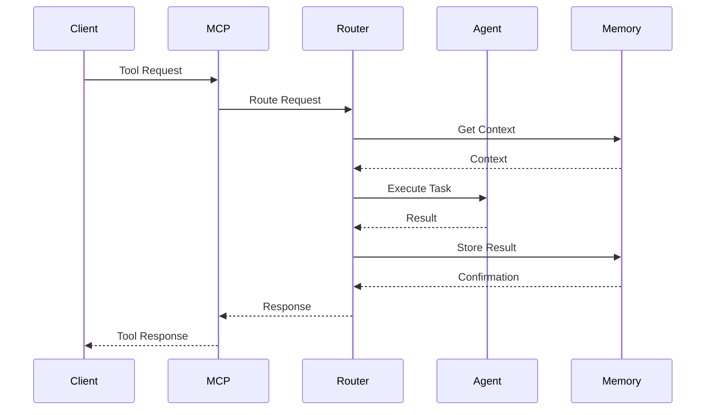
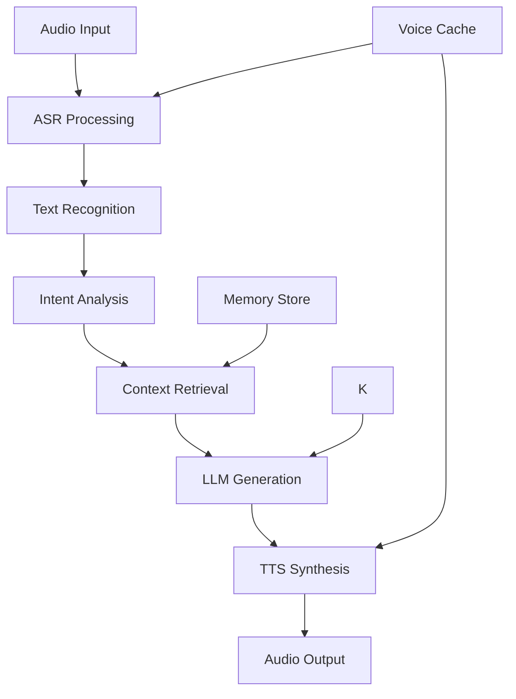
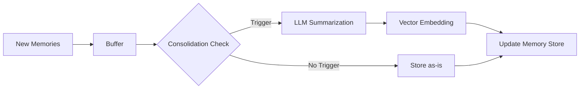

# VIBE MCP Architecture Documentation

This document provides a comprehensive overview of the VIBE MCP (Visual Intelligence Builder Environment) architecture, including system design, component interactions, and key architectural decisions.

## Table of Contents

1. [System Overview](#system-overview)
2. [High-Level Architecture](#high-level-architecture)
3. [Core Components](#core-components)
4. [Component Interactions](#component-interactions)
5. [Data Flow](#data-flow)
6. [Design Patterns](#design-patterns)
7. [Technology Stack](#technology-stack)
8. [Scalability Considerations](#scalability-considerations)
9. [Security Architecture](#security-architecture)
10. [Performance Architecture](#performance-architecture)

## System Overview

VIBE MCP is a multi-agent system that provides intelligent project synthesis capabilities through voice interaction, memory management, and platform integrations. The system follows a modular, event-driven architecture with clear separation of concerns.

### Key Architectural Principles

1. **Modularity** - Each component is independently deployable and testable
2. **Asynchronous Design** - All I/O operations are non-blocking
3. **Provider Abstraction** - Multiple providers for each service type
4. **Event-Driven** - Components communicate through events and messages
5. **Stateless Services** - Core services are stateless with external state management

## High-Level Architecture

```
┌─────────────────────────────────────────────────────────────────┐
│                         VIBE MCP System                         │
├─────────────────────────────────────────────────────────────────┤
│  ┌─────────────┐  ┌─────────────┐  ┌─────────────┐  ┌─────────┐ │
│  │   Voice     │  │    LLM      │  │   Memory    │  │   MCP   │ │
│  │   System    │◄─�│   Router    │◄─┤   System    │◄─┤  Server │ │
│  └─────────────┘  └─────────────┘  └─────────────┘  └─────────┘ │
│         │                │                │              │    │
│  ┌─────────────┐  ┌─────────────┐  ┌─────────────┐  ┌─────────┐ │
│  │   Agent     │  │  Platform   │  │  Database   │  │  Cache  │ │
│  │ Frameworks  │  │ Integrations│  │  (PostgreSQL)│ │ (Redis) │ │
│  └─────────────┘  └─────────────┘  └─────────────┘  └─────────┘ │
└─────────────────────────────────────────────────────────────────┘
```

### Architecture Layers

1. **Interface Layer** - MCP Server exposing tools and APIs
2. **Service Layer** - Core business logic and services
3. **Integration Layer** - External platform integrations
4. **Data Layer** - Databases, caches, and file storage

## Core Components

### 1. MCP Server

The MCP (Model Context Protocol) server is the main entry point, exposing tools and capabilities to client applications.

```python
# src/mcp/server.py
class MCPServer:
    """Main MCP server implementation."""
    
    def __init__(self):
        self.tool_registry = ToolRegistry()
        self.message_handler = MessageHandler()
        self.auth_manager = AuthManager()
```

**Key Features:**
- Tool registration and discovery
- Request routing and handling
- Authentication and authorization
- Protocol compliance

### 2. Voice System

The voice system provides text-to-speech and speech-to-text capabilities with multi-provider support.

```
┌─────────────────┐
│  Voice Manager  │
└─────────┬───────┘
          │
    ┌─────┴─────┐
    │           │
┌───▼───┐   ┌───▼───┐
│  TTS  │   │  ASR  │
└───┬───┘   └───┬───┘
    │           │
┌───▼───────────▼───┐
│   Providers      │
│ ┌─────┐ ┌─────┐  │
│ │Piper│ │Eleven│  │
│ └─────┘ └─────┘  │
└───────────────────┘
```

**Components:**
- **VoiceManager** - Orchestrates TTS/ASR operations
- **TTS Providers** - Piper (local), ElevenLabs (cloud)
- **ASR Providers** - GLM-ASR, Whisper
- **Voice Cache** - Caches generated audio

### 3. Memory System

Advanced memory management with vector storage and intelligent retrieval.

```
┌─────────────────┐
│  Memory System  │
└─────────┬───────┘
          │
    ┌─────┴─────┐
    │           │
┌───▼───┐   ┌───▼───┐
│Mem0   │   │Local  │
│Vector │   │Store  │
└───┬───┘   └───┬───┘
    │           │
┌───▼───────────▼───┐
│   Analytics       │
│ & Consolidation   │
└───────────────────┘
```

**Features:**
- Vector-based semantic search
- Memory types (episodic, semantic, procedural)
- Consolidation and summarization
- Analytics and insights

### 4. Agent Frameworks

Multi-agent system with dynamic framework selection.

```
┌─────────────────┐
│ Framework Router│
└─────────┬───────┘
          │
    ┌─────┴─────┐
    │           │
┌───▼───┐   ┌───▼───┐
│AutoGen│   │Swarm  │
└───┬───┘   └───┬───┘
    │           │
┌───▼───────────▼───┐
│   LangGraph &    │
│     CrewAI       │
└───────────────────┘
```

**Frameworks:**
- **AutoGen** - Complex multi-agent conversations
- **Swarm** - Lightweight agent handoffs
- **LangGraph** - Stateful workflows
- **CrewAI** - Role-based teams

### 5. Platform Integrations

Clients for external platforms and services.

```
┌─────────────────┐
│ Platform Layer  │
└─────────┬───────┘
          │
    ┌─────┴─────┐
    │           │
┌───▼───┐   ┌───▼───┐
│GitLab │   │Firecrawl│
│Client │   │ Client   │
└───┬───┘   └───┬───┘
    │           │
┌───▼───────────▼───┐
│   Browser        │
│  Automation      │
└───────────────────┘
```

**Integrations:**
- **GitLab** - Repository management and CI/CD
- **Firecrawl** - Web scraping and content extraction
- **Browser** - Automated browser interactions

## Component Interactions

### 1. Voice Interaction Flow

```
User Speech
    │
    ▼
┌─────────────┐
│   ASR       │
└─────┬───────┘
      │
      ▼
┌─────────────┐
│ LLM Router  │
└─────┬───────┘
      │
      ▼
┌─────────────┐
│   TTS       │
└─────┬───────┘
      │
      ▼
Audio Output
```

### 2. Memory Access Pattern

```
Query/Context
     │
     ▼
┌─────────────┐
│ Memory      │
│ System      │
└─────┬───────┘
      │
      ▼
┌─────────────┐
│ Vector      │
│ Search      │
└─────┬───────┘
      │
      ▼
Relevant Memories
```

### 3. Agent Execution Flow

```
Task Request
     │
     ▼
┌─────────────┐
│ Framework   │
│ Router      │
└─────┬───────┘
      │
      ▼
┌─────────────┐
│ Selected    │
│ Framework   │
└─────┬───────┘
      │
      ▼
┌─────────────┐
│ Agent       │
│ Execution   │
└─────┬───────┘
      │
      ▼
Result/Action
```

## Data Flow

### 1. Request Processing



### 2. Voice Processing Pipeline



### 3. Memory Consolidation



## Design Patterns

### 1. Provider Pattern

Used for TTS, ASR, and LLM services to enable multiple providers with fallback.

```python
class ProviderManager:
    def __init__(self):
        self.providers = []
        self.current_index = 0
    
    async def execute(self, operation):
        for provider in self.providers:
            try:
                return await provider.execute(operation)
            except Exception:
                continue
        raise NoProviderAvailableError()
```

### 2. Factory Pattern

For creating clients and integrations.

```python
class ClientFactory:
    @staticmethod
    def create_client(client_type, config):
        if client_type == "gitlab":
            return GitLabClient(config)
        elif client_type == "firecrawl":
            return FirecrawlClient(config)
        # ...
```

### 3. Observer Pattern

For event handling and notifications.

```python
class EventManager:
    def __init__(self):
        self.observers = defaultdict(list)
    
    def subscribe(self, event_type, callback):
        self.observers[event_type].append(callback)
    
    async def emit(self, event_type, data):
        for callback in self.observers[event_type]:
            await callback(data)
```

### 4. Strategy Pattern

For framework selection and routing.

```python
class FrameworkRouter:
    def __init__(self):
        self.strategies = {
            "simple": SimpleAgentStrategy(),
            "complex": ComplexAgentStrategy(),
            "workflow": WorkflowStrategy(),
        }
    
    def select_framework(self, task):
        strategy = self.analyze_task(task)
        return self.strategies[strategy].select_framework()
```

## Technology Stack

### Core Technologies

| Component | Technology | Version |
|-----------|------------|---------|
| Language | Python | 3.11+ |
| Web Framework | FastAPI | 0.104+ |
| Async Runtime | asyncio | Built-in |
| Database | PostgreSQL | 15+ |
| Cache | Redis | 7+ |

### Key Libraries

| Area | Library | Purpose |
|------|---------|---------|
| Voice | Piper | Local TTS |
| Voice | transformers | ASR models |
| LLM | litellm | Multi-provider LLM |
| Memory | mem0 | Vector storage |
| Agents | autogen | Multi-agent framework |
| Browser | playwright | Browser automation |
| HTTP | aiohttp | Async HTTP client |

### Infrastructure

| Service | Technology | Purpose |
|---------|------------|---------|
| Containerization | Docker | Deployment |
| Orchestration | Docker Compose | Local dev |
| Message Queue | Redis Streams | Event processing |
| Monitoring | Prometheus | Metrics |
| Logging | structlog | Structured logs |

## Scalability Considerations

### 1. Horizontal Scaling

- **Stateless Services** - Core services are stateless
- **Load Balancing** - Multiple instances behind load balancer
- **Database Sharding** - Partition data by tenant/type
- **Cache Distribution** - Redis cluster for caching

### 2. Vertical Scaling

- **Resource Limits** - Configurable per component
- **Connection Pooling** - Efficient resource usage
- **Batch Processing** - Group operations for efficiency
- **Lazy Loading** - Load resources on demand

### 3. Performance Optimization

```
┌─────────────────┐
│  Performance    │
│   Layer         │
└─────────┬───────┘
          │
    ┌─────┴─────┐
    │           │
┌───▼───┐   ┌───▼───┐
│Cache  │   │Batch  │
│Layer  │   │Queue  │
└───┬───┘   └───┬───┘
    │           │
┌───▼───────────▼───┐
│  Connection      │
│   Pooling         │
└───────────────────┘
```

## Security Architecture

### 1. Authentication & Authorization

```
┌─────────────────┐
│   Auth Layer    │
└─────────┬───────┘
          │
    ┌─────┴─────┐
    │           │
┌───▼───┐   ┌───▼───┐
│JWT    │   │OAuth  │
│Tokens │   │2.0    │
└───┬───┘   └───┬───┘
    │           │
┌───▼───────────▼───┐
│  RBAC            │
│ (Role-Based)     │
└───────────────────┘
```

### 2. Data Protection

- **Encryption at Rest** - Database encryption
- **Encryption in Transit** - TLS for all communications
- **Secret Management** - Environment variables and vaults
- **Data Masking** - Sensitive data obfuscation

### 3. Security Controls

```
┌─────────────────┐
│  Security       │
│  Controls       │
└─────────┬───────┘
          │
    ┌─────┴─────┐
    │           │
┌───▼───┐   ┌───▼───┐
│Input  │   │Output │
│Valid. │   │Filter │
└───┬───┘   └───┬───┘
    │           │
┌───▼───────────▼───┐
│  Audit           │
│  Logging         │
└───────────────────┘
```

## Performance Architecture

### 1. Caching Strategy

```
┌─────────────────┐
│  Multi-Level     │
│     Cache        │
└─────────┬───────┘
          │
    ┌─────┴─────┐
    │           │
┌───▼───┐   ┌───▼───┐
│L1     │   │L2     │
│Memory │   │Redis  │
└───┬───┘   └───┬───┘
    │           │
┌───▼───────────▼───┐
│  L3 Persistent   │
│     Cache         │
└───────────────────┘
```

### 2. Async Processing

- **Non-blocking I/O** - All operations are async
- **Concurrent Execution** - Parallel processing where possible
- **Backpressure Handling** - Flow control for high load
- **Circuit Breakers** - Fault tolerance

### 3. Resource Management

```
┌─────────────────┐
│  Resource       │
│  Manager        │
└─────────┬───────┘
          │
    ┌─────┴─────┐
    │           │
┌───▼───┐   ┌───▼───┐
│Pool   │   │Monitor│
│Mgmt   │   │& Alert│
└───┬───┘   └───┬───┘
    │           │
┌───▼───────────▼───┐
│  Auto-Scaling    │
│  & Recovery      │
└───────────────────┘
```

## Monitoring & Observability

### 1. Metrics Collection

- **System Metrics** - CPU, memory, disk, network
- **Application Metrics** - Request rates, errors, latency
- **Business Metrics** - Active users, tasks completed
- **Custom Metrics** - Component-specific metrics

### 2. Logging Strategy

```
┌─────────────────┐
│  Structured      │
│     Logging      │
└─────────┬───────┘
          │
    ┌─────┴─────┐
    │           │
┌───▼───┐   ┌───▼───┐
│JSON   │   │Trace  │
│Format │   │ID     │
└───┬───┘   └───┬───┘
    │           │
┌───▼───────────▼───┐
│  Log Aggregation │
│   & Analysis     │
└───────────────────┘
```

### 3. Distributed Tracing

- **Request Tracing** - End-to-end request flow
- **Component Tracing** - Internal component calls
- **Performance Analysis** - Bottleneck identification
- **Error Tracking** - Exception propagation

## Deployment Architecture

### 1. Container Strategy

```
┌─────────────────┐
│  Docker          │
│  Containers      │
└─────────┬───────┘
          │
    ┌─────┴─────┐
    │           │
┌───▼───┐   ┌───▼───┐
│App    │   │Sidecar│
│Container│   │(Logging)│
└───┬───┘   └───┬───┘
    │           │
┌───▼───────────▼───┐
│  Orchestration   │
│ (Docker Compose) │
└───────────────────┘
```

### 2. Environment Configuration

- **Development** - Local Docker Compose
- **Staging** - Cloud-based staging
- **Production** - Kubernetes or managed services
- **CI/CD** - Automated deployment pipeline

## Future Architecture Considerations

### 1. Microservices Migration

- **Service Decomposition** - Split monolith into services
- **API Gateway** - Centralized routing and management
- **Service Mesh** - Inter-service communication
- **Event Sourcing** - Event-driven architecture

### 2. AI/ML Enhancements

- **Model Serving** - Dedicated model serving infrastructure
- **Feature Store** - Centralized feature management
- **ML Pipeline** - Automated model training and deployment
- **A/B Testing** - Model performance comparison

### 3. Edge Computing

- **Edge Deployment** - Local processing for low latency
- **Offline Capabilities** - Function without internet
- **Sync Mechanisms** - Data synchronization
- **Edge Security** - Secure edge operations

---

This architecture document serves as the foundation for understanding and extending the VIBE MCP system. For implementation details, refer to the specific component documentation and source code.
