# 📊 AI Project Synthesizer - System Diagrams

> **Professional Architecture Visualizations**  
> **Format:** Mermaid, PlantUML Compatible  
> **Last Updated:** December 2024

---

## Table of Contents

1. [System Overview Diagram](#1-system-overview-diagram)
2. [Component Architecture](#2-component-architecture)
3. [Data Flow Diagrams](#3-data-flow-diagrams)
4. [Sequence Diagrams](#4-sequence-diagrams)
5. [State Machine Diagrams](#5-state-machine-diagrams)
6. [Class Diagrams](#6-class-diagrams)
7. [Deployment Diagrams](#7-deployment-diagrams)
8. [Entity Relationship Diagrams](#8-entity-relationship-diagrams)

---

## 1. System Overview Diagram

### High-Level Architecture

```mermaid
flowchart TB
    subgraph IDE["🖥️ WINDSURF IDE"]
        CASCADE["🤖 Cascade AI"]
    end
    
    subgraph MCP["📡 MCP Protocol Layer"]
        direction TB
        TOOLS["🔧 Tools"]
        RESOURCES["📦 Resources"]
        PROMPTS["💬 Prompts"]
    end
    
    subgraph SYNTH["🧬 AI PROJECT SYNTHESIZER"]
        direction TB
        
        subgraph LAYERS["Processing Layers"]
            DISCOVERY["🔍 Discovery"]
            ANALYSIS["🔬 Analysis"]
            RESOLUTION["⚖️ Resolution"]
            SYNTHESIS["🔧 Synthesis"]
            GENERATION["📝 Generation"]
        end
        
        subgraph LLM["🧠 LLM Orchestration"]
            OLLAMA["Ollama\n(Local)"]
            CLOUD["Cloud APIs\n(Fallback)"]
            ROUTER["RouteLLM\nRouter"]
        end
    end
    
    subgraph EXTERNAL["🌐 External Services"]
        GITHUB["GitHub API"]
        HF["HuggingFace"]
        KAGGLE["Kaggle"]
        ARXIV["arXiv"]
    end
    
    subgraph OUTPUT["📁 Output"]
        PROJECT["Synthesized\nProject"]
        DOCS["Generated\nDocumentation"]
    end
    
    CASCADE -->|stdio| MCP
    MCP --> SYNTH
    DISCOVERY --> EXTERNAL
    LLM --> OLLAMA
    LLM --> CLOUD
    ROUTER --> LLM
    SYNTHESIS --> OUTPUT
    GENERATION --> DOCS
```



---

## 2. Component Architecture

### Layered Component View


---

## 3. Data Flow Diagrams

### Synthesis Pipeline Flow

```mermaid
flowchart LR
    subgraph INPUT["📥 Input"]
        REQ["User\nRequest"]
    end
    
    subgraph PARSE["🔍 Parse"]
        INTENT["Intent\nExtraction"]
    end
    
    subgraph DISCOVER["🔎 Discover"]
        SEARCH["Multi-Platform\nSearch"]
        RANK["Repository\nRanking"]
    end
    
    subgraph ANALYZE["🔬 Analyze"]
        AST_A["AST\nAnalysis"]
        DEP_A["Dependency\nMapping"]
        QUAL_A["Quality\nScoring"]
    end
    
    subgraph RESOLVE["⚖️ Resolve"]
        CONFLICT_R["Conflict\nDetection"]
        SAT["SAT\nSolver"]
        LOCK["Version\nLocking"]
    end
    
    subgraph SYNTHESIZE["🔧 Synthesize"]
        CLONE["Clone\nRepos"]
        EXTRACT["Extract\nComponents"]
        MERGE["Merge\nCode"]
        SCAFFOLD_S["Apply\nTemplate"]
    end
    
    subgraph GENERATE["📝 Generate"]
        README_G["README"]
        ARCH_G["Architecture"]
        DIAGRAMS_G["Diagrams"]
    end
    
    subgraph OUTPUT["📤 Output"]
        PROJ["Complete\nProject"]
    end
    
    REQ --> INTENT
    INTENT --> SEARCH
    SEARCH --> RANK
    RANK --> AST_A
    AST_A --> DEP_A
    DEP_A --> QUAL_A
    QUAL_A --> CONFLICT_R
    CONFLICT_R --> SAT
    SAT --> LOCK
    LOCK --> CLONE
    CLONE --> EXTRACT
    EXTRACT --> MERGE
    MERGE --> SCAFFOLD_S
    SCAFFOLD_S --> README_G
    README_G --> ARCH_G
    ARCH_G --> DIAGRAMS_G
    DIAGRAMS_G --> PROJ
```



### Repository Analysis Flow


---

## 4. Sequence Diagrams

### Full Synthesis Workflow


### Repository Search Sequence


---

## 5. State Machine Diagrams

### Synthesis Pipeline States


### Repository Processing States


---

## 6. Class Diagrams

### Discovery Layer Classes


### Analysis Layer Classes


---

## 7. Deployment Diagrams

### Docker Deployment

```mermaid
flowchart TB
    subgraph HOST["Host Machine (Windows 11 + WSL2)"]
        subgraph DOCKER["Docker Environment"]
            subgraph NET["docker-network: synth-net"]
                SYNTH_C["🧬 synthesizer\nPython 3.11\nPort: 8080"]
                REDIS_C["💾 redis\nRedis Alpine\nPort: 6379"]
                OLLAMA_C["🧠 ollama\nOllama + GPU\nPort: 11434"]
            end
            
            subgraph VOLUMES["Volumes"]
                OUTPUT_V["📁 ./output\n→ /app/output"]
                CACHE_V["📁 ./cache\n→ /app/cache"]
                MODELS_V["📁 ./models\n→ /root/.ollama"]
            end
        end
        
        GPU["🎮 NVIDIA GPU\nRTX 3090/4090"]
    end
    
    SYNTH_C <--> REDIS_C
    SYNTH_C <--> OLLAMA_C
    OLLAMA_C --> GPU
    
    SYNTH_C --> OUTPUT_V
    SYNTH_C --> CACHE_V
    OLLAMA_C --> MODELS_V
```



### Local Development Setup


---

## 8. Entity Relationship Diagrams

### Data Model


---

## Diagram Rendering

### Tools for Viewing

1. **VS Code** - Install "Markdown Preview Mermaid Support" extension
2. **Windsurf** - Built-in Mermaid rendering in markdown preview
3. **GitHub** - Native Mermaid support in markdown files
4. **Mermaid Live Editor** - https://mermaid.live

### Export Options

```bash
# Install Mermaid CLI
npm install -g @mermaid-js/mermaid-cli

# Export to PNG
mmdc -i docs/diagrams/DIAGRAMS.md -o docs/diagrams/output.png

# Export to SVG
mmdc -i docs/diagrams/DIAGRAMS.md -o docs/diagrams/output.svg

# Export to PDF
mmdc -i docs/diagrams/DIAGRAMS.md -o docs/diagrams/output.pdf
```

---

## Quick Reference

| Diagram Type | Use Case |
|--------------|----------|
| Flowchart | System architecture, data flows |
| Sequence | API interactions, workflows |
| State | Process states, transitions |
| Class | Object relationships, inheritance |
| ER | Data models, database design |

